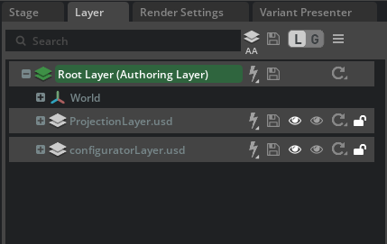
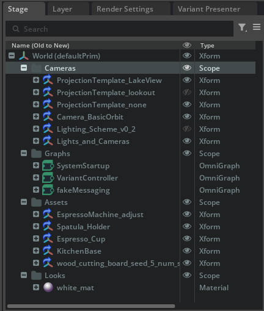
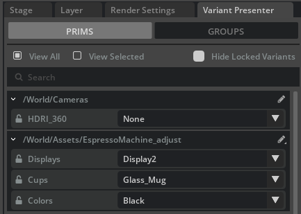
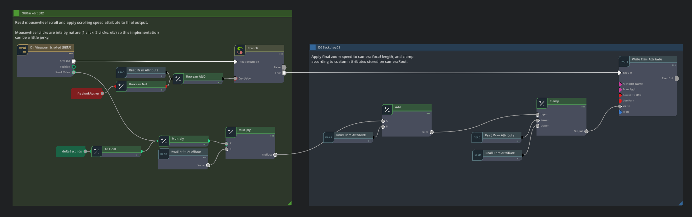
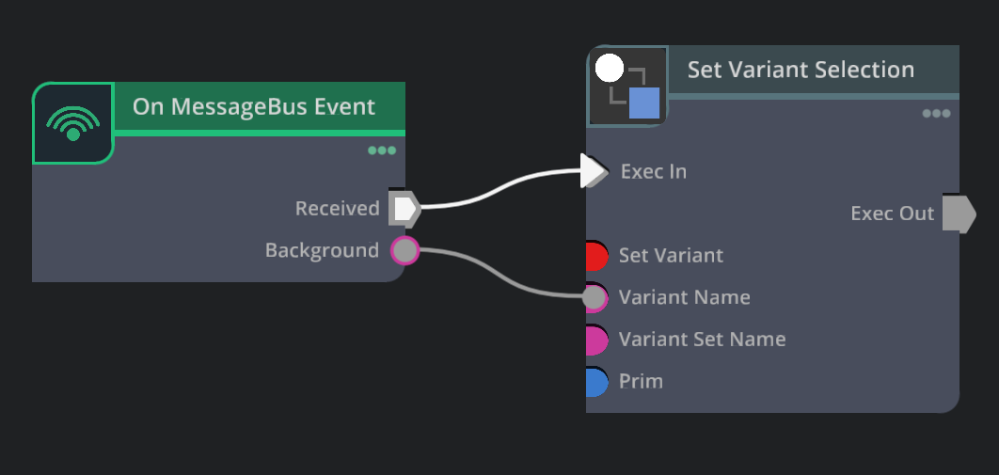

<h2>NVIDIA Omniverse Blueprint: 3D Conditioning for Precise Visual Generative AI</h2>


*Image generated with live interactive demo.*

Developers can integrate NVIDIA NIM microservices to build applications that leverage controllable generative AI for efficient 3D scene creation.

In this workflow guide, we outline how to create a system that allows users to quickly generate and manipulate scene elements, using an espresso machine sample asset. We then describe how other NIM microservices, including USD Code, USD Search, Edify 360 and Edify 3D, can be used to extend that base workflow for enhanced features such as scene layout. 

This guide includes:

1. The standard workflow to replicate what is on the NVIDIA Omniverse Blueprint web page.  
2. Optional NIM that you could integrate on your own to further accelerate scene layout beyond the demonstration in the standard workflow guide.

[NVIDIA NIM](https://www.nvidia.com/en-us/ai/) microservices are a set of accelerated inference microservices that allow developers to easily deploy AI models on NVIDIA GPUs anywhere.

For this workflow, we specifically explore microservices that enable developers to use generative backgrounds, while also taking advantage of OpenUSD for 3D application and workflow development. 


*Image generated with live interactive demo.*

These workflows may include:

* **SDXL \+ ComfyUI**: A fast generative text-to-image model that can synthesize photorealistic images from a text prompt in a single network evaluation with a graph/nodes interface for advanced developers.  

   *The following NIM are optional microservices.*
* **Edify 360 NIM**: Shutterstock Early Access preview of Generative 3D service for 360 HDRI (High Dynamic Range Image) generation. Trained on NVIDIA Edify using Shutterstock's licensed creative libraries.  
* **Edify 3D NIM**: Shutterstock Generative 3D service for 3D asset generation. Trained on NVIDIA Edify using Shutterstock's licensed creative libraries.  
* **USD Code NIM**: A  language model that answers OpenUSD knowledge queries and generates USD Python code.  
* **USD Search NIM**: An AI-powered search for OpenUSD data, 3D models, images, and assets using text or image-based inputs.


All microservices are currently available as a preview on the [NVIDIA API Catalog](https://build.nvidia.com/explore/discover/), where developers can make API calls for evaluation.

By the end of this workflow guide, you will be able to develop your own custom app with AI to enable and accelerate your creative teams.

 # Table of Contents
- [**3D Conditioning for Precise Visual Generative AI**](#3d-conditioning-for-precise-visual-generative-ai)
- [Table of Contents](#table-of-contents)
- [Workflow](#workflow)
  - [**Workflow Summary**](#workflow-summary)
  - [**Workflow Diagram**](#workflow-diagram)
- [Get Started](#get-started)
- [Set Up the Environment](#set-up-the-environment)
    - [**System Requirements**](#system-requirements)
    - [**Required Software Dependencies**](#required-software-dependencies)
    - [**Recommended Software**](#recommended-software)
- [Preview and Set Up an API Key](#preview-and-set-up-an-api-key)
    - [**Get API Key**](#get-api-key)
    - [**Add API Key**](#add-api-key)
- [Customize the Application](#customize-the-application)
  - [Running the Local Desktop Application](#running-the-local-desktop-application)
  - [Creating Your Own Application](#creating-your-own-application)
  - [**Adding Extensions**](#adding-extensions)
    - [**Note** - Use this same process to add your own custom extensions as you further develop your experience.](#note---use-this-same-process-to-add-your-own-custom-extensions-as-you-further-develop-your-experience)
    - [**Configure the Extension**](#configure-the-extension)
- [Add NIM to your custom application](#add-nim-to-your-custom-application)
  - [**Directable Background Generation**](#directable-background-generation)
    - [**Overview**](#overview)
    - [**Requirements and Installation**](#requirements-and-installation)
    - [**Set Up and Open the ComfyUI Graph Example**](#set-up-and-open-the-comfyui-graph-example)
    - [**Configure the Image Generation Service**](#configure-the-image-generation-service)
    - [**Assigning Models and References**](#assigning-models-and-references)
    - [**Augmentation Graph Breakdown**](#augmentation-graph-breakdown)
    - [**Prompting Techniques and Best Practices**](#prompting-techniques-and-best-practices)
    - [**Augmentation Results and Analysis**](#augmentation-results-and-analysis)
  - [**Optional NIM**](#optional-nim)
    - [**Edify 360**](#edify-360)
    - [**Edify 3D**](#edify-3d)
    - [**USD Code and USD Search**](#usd-code-and-usd-search)
- [Hero Asset](#hero-asset)
  - [**Espresso Machine**](#espresso-machine)
    - [**Scene Structure**](#scene-structure)
    - [**USD Variants**](#usd-variants)
- [Set Up Custom Navigation](#set-up-custom-navigation)
- [Enable Scene Layout](#enable-scene-layout)
  - [**Augment the Content Library**](#augment-the-content-library)
- [Messaging \& Configurable Assets](#messaging--configurable-assets)
- [Deployment](#deployment)
  - [Deploying Default Distribution](#deploying-default-distribution)
  - [Building Containers from Source](#building-containers-from-source)
- [Running Locally without Kubernetes](#running-locally-without-kubernetes)
- [Additional Usage](#additional-usage)
  - [Batch Prompt Ideation](#batch-prompt-ideation)
  - [Improved Lighting Options](#improved-lighting-options)
    - [Render Additional Passes](#render-additional-passes)
    - [Reuse the Masks](#reuse-the-masks)
- [Not Safe For Work Filtering](#not-safe-for-work-filtering)
- [Connecting the Kit Application and the Image Generation Service](#connecting-the-kit-application-and-the-image-generation-service)
- [Known Issues and Limitations](#known-issues-and-limitations)
- [Troubleshooting Guide](#troubleshooting-guide)


# Workflow 


*Image generated with live interactive demo.*

## **Workflow Summary**

This workflow shows how you  can augment a content pipeline with generative AI, so your marketing and content teams can achieve the following results.

**Standard Workflow**

*The standard workflow replicates the interactive demo on build.nvidia.com*

The standard workflow allows art directors and artists to keep the hero content rendering with high quality, ray-traced results that are consistent, while prompting generative AI for the supplementary items in the scene to try out ideas. Traditionally, this is a slow process and one that is hard to direct. This workflow shows how to direct and control specific parts of the image without impacting other parts of that same image. For example, the art director can quickly test out different counter top surfaces, while still keeping the high-quality render of their espresso machine.

The standard workflow contains four key components:

1. **On brand hero asset**  A finalized asset, typically approved by an art director, should be considered the hero asset. For this example, we have  provided a simple espresso machine.  
2. **Custom application** Built with the Kit App Template based on Kit 106.2.   
3. **NIM integration**  Microservices and Kit extensions that add generative AI functionality to your custom application.  
4. **Solution testing** Verifies  the functionality and performance of your integrated workflow. 

![][image_in_out]

*Image generated with live interactive demo.*

## **Workflow Diagram**

Follow this step-by-step guide to start your development journey with these new NVIDIA NIM microservices for generative AI development\!

*![][image_ref]*

To summarize the architectural workflow diagram above, we have 3 components 
* Web Front-End 
* Kit Streaming Application 
* Image Generation Service. 
  
The web front end displays the Kit streaming application hosted on a cloud server to the User through the App Streaming API and sends the text prompt created by the User. The Kit streaming application, created by a Developer, captures the viewport (RGB, Depth, Normal) and sends the merged data to the image generation service through a custom Kit extension, also created by a Developer. The image generation service processes the data (runs inference on a diffusion model and etc.) using Artist created assets, such as the Hero Asset, and generative AI to return a new 3D scene with the brand-accurate Hero Asset intact. The Kit streaming application updates with the processed scene and in return is displayed on the web front end in real time.

# Get Started

*Required*

**Manifest**  
For this NVIDIA Omniverse Blueprint, you need the following components:

| Component | Notes |
| :---- | :---- |
| Blueprint Sample repo | The repo you are currently in [https://github.com/NVIDIA-Omniverse-blueprints/3d-conditioning](https://github.com/NVIDIA-Omniverse-blueprints/3d-conditioning) |
| NIM | [https://build.nvidia.com/explore/discover](https://build.nvidia.com/explore/discover) |
| Kit-app-template 106.2 | [NVIDIA-Omniverse/Kit-app-template: Omniverse Kit App Template (github.com)](https://github.com/NVIDIA-Omniverse/kit-app-template/) |
| ComfyUI | [https://github.com/comfyanonymous/ComfyUI](https://github.com/comfyanonymous/ComfyUI) |
| SDXL or similar image to image model | [https://huggingface.co/SG161222/RealVisXL\_V4.0\_Lightning/blob/main/RealVisXL\_V4.0\_Lightning.safetensors](https://huggingface.co/SG161222/RealVisXL_V4.0_Lightning/blob/main/RealVisXL_V4.0_Lightning.safetensors) |

# Set Up the Environment

*Required*

### **System Requirements**

* See [NVIDIA Omniverse Blueprint Card](https://build.nvidia.com/nvidia/conditioning-for-precise-visual-generative-ai/blueprintcard)

### **Required Software Dependencies**

* Git: For version control and repository management  
* Git LFS: For managing large files within the repository  
* (Windows) Microsoft Visual C++ Redistributable: Many Windows systems already have this installed. If not, you can obtain it from [latest-supported-vc-redist](https://learn.microsoft.com/en-us/cpp/windows/latest-supported-vc-redist?view=msvc-170#latest-microsoft-visual-c-redistributable-version).  
* (Linux) build-essentials: A package that includes make and other essential tools for building applications. For Ubuntu, install with `sudo apt-get install build-essential`. For deployment, you must use Linux and have Kubernetes.  
* Node.js

### **Recommended Software**

* VS Code (or your preferred IDE): For code editing and development.


# Preview and Set Up an API Key 

*Optional*

NIM APIs can be found on the [NVIDIA API Catalog](https://build.nvidia.com/explore/discover). Follow this example to generate an API key from the API Catalog Preview of each of the optionally desired NIMs as they appear throughout this guide.

### **Get API Key**

1. Get your NVIDIA API key.  
   1. Go to the [NVIDIA API Catalog](https://build.nvidia.com).  
   2. Select any model.  
   3. Click **Get API Key**.

### **Add API Key**

The following instructions create a temporary environment variable to store your API key. Environment variables set with this method are only stored for a single session. Once a given CMD/PowerShell/Terminal window is closed, these values are  no longer stored.

**Windows CMD**

1. Open Command Prompt.  
   1. Enter the following command:  
   2. `set NVIDIA_API_KEY="<YOUR_API_KEY>"`  
2. Windows PowerShell  
   1. Open PowerShell.  
   2. Enter the following command:  
   3. `$env:NVIDIA_API_KEY="<YOUR_API_KEY>"`

   **Note \-** If the two commands above are not working, you can add API key to Windows System Environment Variables.  

   Key: `NVIDIA_API_KEY`

   Value: `<YOUR_API_KEY>`  

3. Linux Terminal  
   1. Open Terminal.  
   2. Enter the following command:  
      ```   
      export NVIDIA_API_KEY="<YOUR_API_KEY>"  
      ```

# Customize the Application

*Required*


*Image generated with live interactive demo.*

After you have experienced the Interactive demo from NVIDIA Blueprint website, you may want to customize the experience to your own needs.

## Running the Local Desktop Application

If you wish to simply build and try out the local desktop sample, read this section. This will run a Kit application that locally reproduces similar experience to the Interactive demo from NVIDIA Blueprint website, EXCEPT that the image generation service is a stub where it will return static image instead of running diffusion models. We provide guide to create your own image generation service specifically [here](#configure-the-image-generation-service).

If you wish to create your own Kit application, skip to the next section.

You can build the stub image generation service first by going into the directory and following these steps:

1. Build `pip install -r requirements.txt` (you should be in `imagegen_stub` directory)
2. `python imagegen_stub.py`

Then, open another terminal or CMD, then build `kit-streamer` (instruction is inside the directory, which we have copied here for convenience):

1. Please follow [this step](#connecting-the-kit-application-and-the-image-generation-service).
2. Build the Kit application:

     **Linux**: `./build.sh -r`
     **Windows**: `build.bat -r`

3. Run the Kit desktop application:

     **Linux**: `./_build/linux-x86_64/release/omni.app.conditioning_for_precise_visual_generative_ai_desktop.sh`
     **Windows**: `_build\windows-x86_64\release\omni.app.conditioning_for_precise_visual_generative_ai_desktop.bat`

When you press the run button, you are expected to see [this image](#the-stub-image-generation-output) as an output.

You can further modify the source code in their respective directories and locally test them.

For the stub image generation service, we provide an optional guide on how to implement your own in [this section](#directable-background-generation).

We have [Deployment subsection](#running-locally-without-kubernetes) in this document for reproducing the web version.

NOTE: If the desktop application's font size is too small, adjust the `app.font.size = 18` in the `omni.app.conditioning_for_precise_visual_generative_ai_desktop.kit`


## Creating Your Own Application

If you wish to create your own Kit application, continue reading this section.

The first step with these microservices is to set up a custom application, which you can then use to connect to the microservices and develop custom tools for building your generative AI images. Setting up your custom application is a foundational step, and the environment you build can be used with multiple use cases. 

[Kit App Template](https://github.com/NVIDIA-Omniverse/kit-app-template/) enables  developers fine-tune their custom application needs based on Kit 106.2. 

Before getting started with the Kit template defined here, ensure your development environment meets the system requirements outlined in this document [here](#system-requirements).

1. Clone the Kit App Template repository using the following command:  
   ```
   git clone https://github.com/NVIDIA-Omniverse/kit-app-template.git  
   ```

2. Go to the kit-app-template directory by running the following command:  
   ```
   cd kit-app-template
   ```

   **Note** Windows Long Path: When cloning the kit-app-template repository, some Windows users may experience issues if the directory is deeply nested in their file system. To avoid this issue, place the kit-app-template repository near the root of the file system to avoid long path issues.

     
3. Create a new application using the command line. For this example, follow [these instructions](https://github.com/NVIDIA-Omniverse/kit-app-template/tree/main/templates/apps/kit_base_editor) to set up the Kit Base Editor.  
4. Create a new application:

   	**Linux**: `./repo.sh template new`
   	**Windows**: `.\repo.bat template new`

5. Follow the prompt instructions.  
   * Select **Yes** to accept the EULA agreement.  
   * Select **Application** using arrow keys.  
   * Select **Kit Base Editor** using arrow keys.  
     ![][image3]  
   * Enter name of the application `.kit` file.  
     * This should be name-spaced, lowercase, and alphanumeric.  
   * Enter the application display name \[set application display name\].  
   * Enter Version \[Set App Version\].  
6. Build your application using the provided build scripts:

   	**Linux**: `./repo.sh build`
   	**Windows**: `.\repo.bat build`

7. Launch your application in developer mode.  

   	**Linux**: `./repo.sh launch -d`
		**Windows**: `.\repo.bat launch -d`

8. Select with arrow keys which application would you like to launch: `my_company.my_editor.kit`

   You are expected to see [this image](#the-stub-image-generation-output) as an output.

   **Note** Do not select `my_company.my_editor_streaming.kit`.

   The initial startup may take 5 to 8 minutes as shaders compile for the first time. After initial shader compilation, startup time is  reduced.

   NOTE: If the desktop application's font size is too small, adjust the `app.font.size = 18` in the `omni.app.conditioning_for_precise_visual_generative_ai_desktop.kit`

## **Adding Extensions**

*Required*  


*Image generated with live interactive demo.*

To replicate the functionality as experienced on [NVIDIA Omniverse Blueprints](https://build.nvidia.com/nim/agent-blueprints), you'll need to add extensions to the custom app built from kit-app-template. This part is already done for you and is part of the Blueprint download.  To replicate this on a fresh setup like above, you need to follow these steps.


1. Open the `{full-path-kit-app-template}\source\apps` and copy the blueprint's apps that exist under the same path (e.g. `{full-path-blueprint-repo}\kit-streamer\source\apps`)
   1. Simply copy over `omni.app.conditioning_for_precise_visual_generative_ai.kit`
   1. You would want to change the `omni.app.conditioning_for_precise_visual_generative_ai_desktop.kit` to your app name (e.g., `my_company.my_editor.kit`)
   2. You would want to change the `omni.app.conditioning_for_precise_visual_generative_ai_streaming.kit` to your app name (e.g., `my_company.my_editor_streaming.kit`)
2. Open the `{full-path-kit-app-template}\source\extensions` and copy the blueprint's extensions that exist under the same path (e.g. `{full-path-blueprint-repo}\kit-streamer\source\extensions`)
3. Open the `{full-path-kit-app-template}\premake.lua` and include the following at the first among other `define_app` calls:
   ```
      define_app("omni.app.conditioning_for_precise_visual_generative_ai.kit")
   ```
4. Open the `{full-path-kit-app-template}\repo.toml` edit the `Extensions precacher` as following:
   ```
      [repo_precache_exts]
      # Apps to run and precache
      apps = ["${root}/source/apps/omni.app.conditioning_for_precise_visual_generative_ai.kit", "${root}/source/apps/my_company.my_editor.kit", "${root}/source/apps/my_company.my_editor_streaming.kit"]

      registries = [
         { name = "kit/default", url = "https://ovextensionsprod.blob.core.windows.net/exts/kit/prod/106/shared" },
         { name = "kit/sdk", url = "https://ovextensionsprod.blob.core.windows.net/exts/kit/prod/sdk/${kit_version_short}/${kit_git_hash}" },
         { name = "kit/community", url = "https://dw290v42wisod.cloudfront.net/exts/kit/community" },
      ]
   ```
5. Open the `{full-path-kit-app-template}\tools\deps\pip.toml` and copy over the content from `{full-path-blueprint-repo}\kit-streamer\deps\pip.toml`, and change the relative pathing from `..` to `../..`
6. Rebuild and Restart the application.		

You can read `*.kit` files to see how extensions are added (i.e. `"omni.ai.viewport.core" = {}` under [dependencies]).

   ### **Note** \- Use this same process to add your own custom extensions as you further develop your experience.

### **Configure the Extension**

The above extensions will connect your custom Kit application to ComfyUI and the generative image ai model connected to it as well as the configurable options with USD Variants and event messaging with Omni Graph.  It also uses the same style UI as shown in the interactive web experience demonstrating how the Kit UI can be customized. Understanding the following connections will help you connect your own content.

You'll need to also have completed the steps in the [ComfyUI set up section](#set-up-and-open-the-comfyui-graph-example)

Don't forget to follow [this step](#connecting-the-kit-application-and-the-image-generation-service).

**Note** \- Follow each NIM extension, where applicable, to add your API key to enable your NIM.

# Add NIM to your custom application

*Required*

There are a variety of ways to use AI to augment a workflow in a directable manner. First, you must integrate the NIM to a custom Kit extension and add it to your custom Kit application.

The microservices in this workflow are currently available as a preview on the [NVIDIA API Catalog](https://build.nvidia.com/explore/discover/), where developers can make API calls for evaluation. Reference the included section in this guide [here](#preview-and-set-up-an-api-key) to acquire API key for NIM.

In order to integrate NIM into your application, you will be making API calls to the various endpoints. NIMs are purposefully made to be easy to deploy anywhere in an optimized fashion. Depending on how you deploy the NIM, your setup will vary; however, once NIMS are operating, it is a simple task of making your API calls and working with the results.

## **Directable Background Generation**

*Required*


*Image generated with live interactive demo.*

### **Overview**

ComfyUI as used in the context of this NVIDIA Omniverse Blueprint helps teams articulate specific objects, and areas of a composition to target for prompts. ComfyUI is also used to ensure that hero assets used are not affected by any generative AI in the final image. By doing this, creators can  more accurately utilize generative AI.

For the use of this generative AI image model, a Kit extension is created to present the user with some basic controls. This Kit extension handles the processing of the viewport for the appropriate buffers and masks and sends the information to the ComfyUI graph to prompt and process. The results are then composited and displayed back to the end user as a final image.

* SDXL + ComfyUI  
* Custom Kit Extensions

### **Requirements and Installation**

Before you get started, review the following requirements, then follow the ComfyUI installation instructions below.  
   
The document discusses legacy ComfyUI instead of V1.

Estimated time about 20 min depending on internet connection.

1. Check your hardware matches the [Technical Requirements for the Omniverse Platform.](https://docs.omniverse.nvidia.com/embedded-web-viewer/latest/common/technical-requirements.html)  
2. Install [ComfyUI](https://github.com/comfyanonymous/ComfyUI) by following the installation instructions on their Github page.  
   1. **Windows** \- It is easiest to [install the portable standalone build](https://github.com/comfyanonymous/ComfyUI?tab=readme-ov-file#windows) for Windows, however a [manual install](https://github.com/comfyanonymous/ComfyUI?tab=readme-ov-file#manual-install-windows-linux) will also work.  
   2. **Linux** \- Use the [manual install](https://github.com/comfyanonymous/ComfyUI?tab=readme-ov-file#manual-install-windows-linux) method.  
3. Install [ComfyUI Manager](https://github.com/ltdrdata/ComfyUI-Manager) by following the installation instructions on their Github page. Pay special attention to the different methods.  
   1. **Windows** with the portable version of ComfyUI should choose [method 2](https://github.com/ltdrdata/ComfyUI-Manager#installationmethod2-installation-for-portable-comfyui-version-comfyui-manager-only).  
      1. Skip to step 2 and save the link directly to avoid having to install git.   
   2. **Windows** or **Linux** with a manual install, choose [method 1](https://github.com/ltdrdata/ComfyUI-Manager#installationmethod1-general-installation-method-comfyui-manager-only).  
4. Download and install the required models and supporting files.  
   1. Download the RealVisXL_V4.0_Lightning model file  [RealVisXL_V4.0_Lightning.safetensors](https://huggingface.co/SG161222/RealVisXL_V4.0_Lightning/blob/main/RealVisXL_V4.0_Lightning.safetensors).   
      1. Move the file to the ComfyUI installation folder under `ComfyUI\models\checkpoints\`.  
   2. Download the ControlNet Union model [diffusion\_pytorch\_model.safetensors](https://huggingface.co/xinsir/controlnet-union-sdxl-1.0/blob/main/diffusion_pytorch_model.safetensors).  
      1. Move the file to the ComfyUI installation folder under `ComfyUI\models\controlnet\`.  
   3. Download the example files provided for this workflow from the synthetic-data-examples on Github.  
      1. Sample images to be augmented by the ComfyUI graph.  
         1. [Sample files](https://github.com/NVIDIA-Omniverse-blueprints/3d-conditioning/blob/main/kit-streamer/source/extensions/omni.ai.viewport.core/data/sample_files)  
      2. The ComfyUI graph.  
         1. [https://github.com/NVIDIA-Omniverse-blueprints/3d-conditioning/kit-streamer/source/extensions/omni.ai.viewport.core/data/latest_example.json](https://github.com/NVIDIA-Omniverse-blueprints/3d-conditioning/blob/main/kit-streamer/source/extensions/omni.ai.viewport.core/data/latest_example.json)

### **Set Up and Open the ComfyUI Graph Example**

ComfyUI is a powerful backend and GUI for building and executing pipelines using diffusion models and more.

![][image4]

1. Run ComfyUI.  
   1. Windows Portable \- Run `ComfyUI_windows_portable\run_nvidia_gpu.bat`  
   2. Windows and Linux Manual Install \- Using the command line, run `python main.py`  
   3. The ComfyUI server process runs in a command line window. There, you can view what ComfyUI is doing if you need to check for errors, warnings, or to see the progress of image generations.  
   4. When fully loaded ComfyUI  opens a window in your Internet browser with the local address '[http://127.0.0.1:8188/](http://127.0.0.1:8188/)'. This is connecting the visual frontend to the ComfyUI server now running in the background.  
2. Loading the example graph.  
   1. Next, 'Load' the file `latest_example.json` that was downloaded  earlier from the example links. Click the **Load** button on the ComfyUI menu. Navigate to the location of the downloaded `.json` graph and open it.  
      ![][image5]  
   2. You should see an error window showing missing dependencies, along with red 'missing' nodes behind it. This is expected.  
      ![][image6]  
   3. This issue can be resolved by following the steps below.  
      1. Click the **Manager** button at the bottom of the ComfyUI menu.  
         ![][image7]  
      2. If you do not see a **Manager** button, see the [ComfyUI Manager](https://github.com/ltdrdata/ComfyUI-Manager) section in the 'Requirements and Installation' section of this guide.  
      3. Select the **Install Missing Custom Nodes** button in the middle top section of the ComfyUI Manager Menu.  
         ![][image8]  
      4. Select **Install** for each of the listed node dependencies, or you can select the checkbox next to ID (upper left) to select them all, then select **Install**. These may take several minutes, depending on your Internet speed and hardware. You can check the progress of these downloads in ComfyUI's command line window.  
         ![][image9]  
      5. Once you have installed all node dependencies, click on the red **Restart** button at the bottom. This restarts the ComfyUI local server to enable the newly added dependencies. Note that you do not need to close the browser window, but a 'Reconnecting…' dialog is  displayed until the server has been restarted.  
      6. This first restart may take several minutes, downloading more dependencies as needed. You can always view the progress in the command line window.  
      7. After installing the dependencies, your graph should no longer display any bright red missing nodes.

### **Configure the Image Generation Service**

This step covers how to configure the image generation service with the ComfyUI Graph generated so far.

#### **Running ComfyUI Locally as an Example Service**

To quickly reproduce the demo functionalities, you can leverage the ComfyUI that you already have.

1. Import `json` file from [here](https://github.com/NVIDIA-Omniverse-blueprints/3d-conditioning/blob/main/kit-streamer/source/extensions/omni.ai.viewport.core/data/latest_workflow.json), then click on 'Save (API Format)' button. You may need to tick 'Dev mode Options' by clicking the Settings button on the top right (gear icon).
2. Export to overwrite [this file](https://github.com/NVIDIA-Omniverse-blueprints/3d-conditioning/blob/main/kit-streamer/source/extensions/omni.ai.viewport.core/workflows/realtime_workflow_v3.json). 

![][image_loader]

* Notice that we are referring to `latest_workflow.json` instead of `latest_example.json` here. The difference between the two graphs is that the image loaders (bottom left one) are hooked up to nodes that receive image data from the Kit application (top left one). 

* If you have added/modified/removed input text nodes or image loaders, you should make corresponding changes to the `.spec` file [here](https://github.com/NVIDIA-Omniverse-blueprints/3d-conditioning/blob/main/kit-streamer/source/extensions/omni.ai.viewport.core/workflows/realtime_workflow_v3.spec) manually to hook up the Kit application and the image generation service.

* Don't forget to follow [this step](#connecting-the-kit-application-and-the-image-generation-service) on the Kit application.

* If you are hitting any issues with path on model files or controlnet files, read [this section](#assigning-models-and-references).

#### **Creating a Deployable Service**

Follow this guide to take further steps to create a service that can be deployed in our [deployment section](#deployment). You may skip it for now if you not wish to deploy at the moment.

1. Inspect the ComfyUI installation directory
   1. `custom_nodes` contains the nodes you need to include in your service
   2. `models` contains the diffusion models and/or controlnet that you need to include in your service
2. We recommend you modify existing `imagegen_stub` directory to quickly come up with working service
   1. Modify the dockerfile to install essential packages to install Python3.10 or higher, pip, git, git lfs and wget
   2. `git clone` ComfyUI (you may prefer to pin the commit by `git checkout <COMMIT_HASH>`)
   3. `cd` into `custom_nodes` directory and `git clone` all the nodes with pinning
   4. `wget` the diffusion model and/or controlnet to `models` directory
   5. Expose the port you wish to use
   6. Run ComfyUI by specifying the ip address and the port number (Now `imagegen_stub.py` is no longer relevant, so you can delete it)

Here's an example of how you can structure your Dockerfile:

```
# Dockerfile for setting up ComfyUI environment
# Replace <BASE_UBUNTU_IMAGE> with your base Ubuntu Image
FROM <BASE_UBUNTU_IMAGE>

# Replace <PACKAGE_X> with packages you want to install
RUN apt update && apt install -y <PACKAGE_1> <PACKAGE_2> ... <PACKAGE_X>

# Replace <WORKDIR_PATH> with your working directory path for ComfyUI installation
WORKDIR <WORKDIR_PATH>

# Set virtual environment here

# Clone ComfyUI repository, pinning to a specific commit hash if needed
# When you are pip installing (Pytorch, xFormers, etc), beware of using proper options such as --index-url https://download.pytorch.org/whl/cu121
RUN git clone <COMFYUI_REPO_URL> && cd <COMFYUI_DIRECTORY> && git checkout <COMMIT_HASH> && pip install -r requirements.txt

# Download diffusion models and/or controlnet
RUN wget -c <DIFFUSION_MODEL_URL> -P <COMFYUI_DIRECTORY>/models/checkpoints/
wget  -c <CONTROLNET_URL> -P <COMFYUI_DIRECTORY>/models/controlnet/

# Clone ComfyUI custom node repository, pinning to a specific commit hash if needed
# Note that some ComfyUI custom nodes does not contain any installable packages, so you may skip it if it's not necessary for your use case
RUN cd <COMFYUI_DIRECTORY>/custom_nodes && git clone <COMFYUI_CUSTOM_NODE_REPO_URL> && cd <COMFYUI_CUSTOM_NODE_DIRECTORY> && git checkout <COMMIT_HASH> && pip install -r requirements.txt

# Create a directory for checkpoints if it doesn't exist already (you may change /tmp/ckpts path as per your requirements)
RUN mkdir -p /tmp/ckpts

EXPOSE <PORT>

ENTRYPOINT ["python", <COMFYUI_MAIN_PATH>, "--listen", <IP_ADDRESS>, "--port", <PORT>]
```


### **Assigning Models and References**

Now, your ComfyUI graph should look similar to the example shown below. Next, the models and image references in the green sections need to be assigned.

This section demonstrates the manual set up of comfyUI with the example graph and images. The intent is to show where comfyUI operates in the workflow, to get an understanding of what the graph does internally and to play around with prompts and parameters.

Ultimately, ComfyUI is connected to your Kit application and the output of that app is sent as masks and images to the graph.

![][image10]

1. Assign the `sd_xl_base_1.0.safetensors` model in the 'Load Checkpoint' node. Directly click on the highlighted section and select the model from the popup list. This must be done to refresh the assignment of the model, even though it may show correctly, if not reassigned here, queueing a prompt later will error.

   ![][image11]

2. Assign the `diffusion_pytorch_model.safetensors` and model to the 'Load Advanced ControlNet Model' node. As before, directly click on the highlighted section, and select the model from the popup list. This must be done to refresh the assignment of the model, even though it may show correctly, if not reassigned here, queueing a prompt later will error.  
3. Next assign the sample images to the nine nodes.

   ![][image12]

   1. Click on 'choose file to upload' on each of the nodes, and select the images listed below. The sample images are found in the Sample Files downloaded previously in the Requirements and Installation section above.  
      1. `Image - RGB` Node  
         `sample_files/rgb.png`  
      2. `Image - Normals` Node  
         `sample_files/normals.png`
      4. `Image Mask - Coffee Machine` Node  
         `sample_files/coffee_machine.png`  
      5. `Image Mask - Jar` Node  
         `sample_files/jar.png`  
      6. `Image Mask - Board` Node  
         `sample_files/board.png`  
      7. `Image Mask - Plate` Node  
         `sample_files/plate.png`  
      8. `Image Mask - Not Walls` Node  
         `sample_files/non_walls.png`  
      9. `Image Mask - Kitchen` Node  
         `sample_files/kitchen.png`  
4. In the ComfyUI menu, click the **Queue Prompt** button, featured prominently at the top. You should see a green progress bar displayed, with an update at the top of the browser window. When complete, the generated image is  displayed in the 'Save Image' node at the farthest right edge of the graph.  
   1. Saved images are written by default to the ComfyUI installation `ComfyUI\output` folder.  
5. The final graph with a successfully completed prompt should look like the example shown below.:  
   

![][image4]

### **Augmentation Graph Breakdown**

The ComfyUI graph itself is a developer tool for building and iterating on pipelines. Another way to think about it is 'programming with models'. Below is an image of the example graph and the different sections and their purpose.

![][image13]

Overall, the graph uses 'regional prompting' with the masks. This allows us to describe the visual properties of the different parts of the image.

Let's explore the graph for a more complete understanding of how it works.

1. **Load Images and Models, Prompts and Generation Quality**  
   1. This is the section where setup was performed. Input images, model, image size, and global and regional prompts are all here.  
   2. Prompts are primarily responsible for the changes in output generations. The 'Global Prompt' controls the overall influence for the scene generation. Describe features of the kitchen here, such as style and lighting, the materials of the counter top, window frames and cabinets.
  
      ![][image14]  
   3. The Mask Prompts (to the right) control the visual aspects of each masked area. You can get specific with details of the masked objects in the scene, such as the backsplash, plate, vase and cutting board.

   4. The image resolution can be set here, along with the biggest factor in image quality, the 'steps'. Lowering steps to 10 will reduce generation time but affect quality. Conversely, around 20 can give better results at the expense of time.
  
      ![][image15]  
2. **Process Images and Masks**  
   1. The masks and images are processed into a format suitable for the regional prompting and other areas of the graph.   
   2. When connected to the Kit application, it sends ComfyUI the information it needs.  
3. **Regional Prompting**  
   1. The 'Conditioning (SetMask)' nodes take a prompt and a mask to determine the conditioning of the different parts of the image. These nodes and prompts form the heart of the graph and are the most important piece influencing the output generations.  
   2. The prompts used in this section can be found and changed in the “Input Images” and “Global Prompts” green sections.  
4. **ControlNets**  
   1. The controlnet models are used to constrain and inform guidance for the generation of the outputs. These are critical for the control of the structure of the outputs. Without these, the model would be free to imagine anything loosely based on the prompts, with no adherence to the exact placement of the objects in the scene.  
   2. We use 'Normals' and 'HED' (outlines) as the guides to help the model adhere to the structure of the input image.  
   3. The controlnet 'strength' values (shown in the image below) can be adjusted to relax the adherence to the normals and outlines. Lower values give the model more 'creative' freedom in what gets generated but may deviate from the shape and boundaries of the 3D scene.
      ![][image_controlnet] 
   4. We also create a weighted mask to guide the controlnet strength per mask. For example, the backsplash could have a low weighting, giving the model more creative freedom, while keeping the vase and plate at 1.0 so they closely follow the input controlnet images. The controlnet weights are set in the green sections at the top of the graph as shown below. 
      ![][image_controlnet_weights]
5. **Inpainting**  
   1. Inpainting (or outpainting) simply means generating a masked area inside or outside of an area that remains unchanged. In this case, the espresso machine is unchanged while the outer areas are generated.  
6. **KSampler**  
   1. This is the node that performs the work in the graph. It iteratively denoises the image over many steps until it completes.  
      ![][image16]  
   2. When using different models, the steps, cfg, sampler\_name and schedulers should be tuned to get the best results. Details of the parameters and their functionality can be found [here](https://blenderneko.github.io/ComfyUI-docs/Core%20Nodes/Sampling/KSampler/).  
7. **VAE Decode and Composite**  
   1. This simply decodes the image from latent space, composites the masked espresso machine back in, and saves the result.

### **Prompting Techniques and Best Practices**

We're in the early days of generative models as a technology. The techniques within this example affect results in different ways. Below are some considerations to keep in mind.

**Prompting**

There is a 'global prompt' and 'regional' prompts. The global prompt guides the entire generation, including (to a degree) the regional areas. It's best practice to keep the global description to the lighting, the quality and style of the scene, and avoid words like colors which can get misinterpreted.

Prompt adherence and natural language is an improving area for diffusion models, but this base model (SDXL) is not perfect. It can be challenging to successfully generate outputs with detailed descriptions. Each generation uses a random seed, and several tried may be needed to get the best results.

The weights of words in prompts can be altered. '(blue:1.5)' will increase the prompt weight by 1.5 times against other words in that prompt. Lastly, the ordering of words in prompts matters. [Best practices for prompting with ComfyUI can be found here.](https://comfyui-wiki.com/tutorial/basic/stable-diffusion-prompt-basic)

Keeping Prompts to 3-5 phrases generally is recommended to yield the best results.


**Normal Map and Outline (HED) Controlnets**

Controlnets use images to guide the model's outputs. In the example we use normal maps, and outlines. This helps the model maintain the shapes of the geometry in the scene, and ‘understand’ edges and discontinuities and object bounds.

Controlnets are an incredible tool for constraining models but they can come at the expense of model creativity or visual realism.

If you want to make the ‘plate’ into a bagel, you’re asking the model to do two conflicting things, because the shape of the normals and outline controlnets is trying to adhere to a plate shape. The strength of the controlnets can be modified in the graph section “Controlnet Weights”. The resulting weight image is displayed in the controlnet section (section 4). Lowering the weight of the ‘plate’ region will free the model up to generate different objects of different shapes and sizes.

Using Controlnets is a balance between control and creativity. Some experimentation can be needed to find the sweet spot.


### **Augmentation Results and Analysis**

The examples below demonstrate generations from the sample images with the RealViz4 model. This model is a finetune on the base SDXL model, with an emphasis on photographic quality. Additionally, this model is a lightning model, (distilled) to perform much faster than the base SDXL model. As always, check the licenses on the models you choose to ensure your use is compliant.


![][image18]

*Image generated with live interactive demo.*

## **Optional NIM**

Edify 3D, 360, USD Code, and USD Search are all optional NIM that you can extend this workflow with.  The following sections point you to resources to get started.

### **Edify 360**

*Optional*

With Shutterstock's Generative 3D service, users can now simply describe the exact environment they need in text or with an image, and out comes a high-dynamic-range panoramic image (360 HDRI) in brilliant 16K resolution. (See video below.)   
[blogs.nvidia.com/wp-content/uploads/2024/07/3\_HDRi\_SD\_30fps\_fast.mp4?\_=1](https://blogs.nvidia.com/wp-content/uploads/2024/07/3_HDRi_SD_30fps_fast.mp4?_=1)

* You can try out the preview model directly on build.nvidia.com here: [NVIDIA NIM | edify-360-hdri-early-access](https://build.nvidia.com/shutterstock/edify-360-hdri-early-access)  
* Developers can get API access here: [The Ultimate Generative 3D API ToolKit | Shutterstock](https://www.shutterstock.com/discover/generative-ai-3d)  
* In this NVIDIA Omniverse Blueprint, we have supplied example HDRI images for you to test with.

  **Note** \- The Espresso Machine sample file includes two 360 HDRI images. Both were generated with  this NIM. You can switch between them in the interactive demo or the local kit app using the espresso machine configuration section. 

### **Edify 3D**

*Optional* 

Available now for enterprises in commercial beta, Shutterstock's Edify 360 service enables  designers and art directors to quickly generate 3D objects that help them prototype or populate virtual environments. For this example, Edify 3D uses generative AI to create assets like the cutting board on the kitchen counter, so you can focus on designing the espresso machine or developing the application.

* You can try out the preview model directly on build.nvidia.com here: [NVIDIA NIM | edify-3d](https://build.nvidia.com/shutterstock/edify-3d)  
* Developers can get API access here: [The Ultimate Generative 3D API ToolKit | Shutterstock](https://www.shutterstock.com/discover/generative-ai-3d)  
* Learn more below in the [Augmenting the Content Library](#augment-the-content-library) section.


  **Note** \- The Espresso Machine sample file includes a cutting board. This was generated with this NIM and included in the file to demonstrate more ways to seed your scene. 

### **USD Code and USD Search**

*Optional* 

Optionally, you can integrate USD Code and USD Search to enable users to build scenes to place your configurable product asset. USD Code and USD Search help art directors add set dressing without needing to write the code themselves. USD Search uses AI to help identify and find the assets, while USD Code helps write Python code snippets and can execute scene modification directly. 

* [USD Code NIM — Omniverse Services latest documentation (nvidia.com)](https://docs.omniverse.nvidia.com/services/latest/services/usd-code/overview.html)  
* [USD Search NIM — Omniverse Services latest documentation (nvidia.com)](https://docs.omniverse.nvidia.com/services/latest/services/usd-search/overview.html)

If you want to develop Python code for OpenUSD directly in VS Code, you can use these links to easily set up [USD Code NIM](https://docs.omniverse.nvidia.com/services/latest/services/usd-code/overview.html) in [VS Code](https://docs.omniverse.nvidia.com/services/latest/services/usd-code/get-started.html#nim-vscode).

Learn more below in the [Enabling Scene Layout](#enable-scene-layout) section.

# Hero Asset

*Required* 

The hero asset represents a final, digital version of a product. This could be anything from an espresso machine to a car. The hero asset is intended to be locked away from any generative AI so that it maintains the final signed off quality of the art and design teams, allowing it to be consistent and unchanged from its original intent.

For this demonstration, the hero asset is configurable, meaning there are several variants built into the asset. It is not required to use a configurable asset; however, it is a common use case with several advantages. Having the hero asset as a configurable asset allows your end user to rapidly switch between different components, colors, and setups with just a push of a button. Leveraging OpenUSD, these configurable assets are easy to author and make it simple to build interactive applications. 

## **Espresso Machine**


*Image generated with live interactive demo.*

The scene we start with intentionally only has the espresso machine fully set up with materials and lighting. The set dressing in a flat white material, it is also possible to have these objects textured if that is available. For the purposes here, having the background object just laid out in a flat white material demonstrates that an environment only needs to have basic objects blocked in order to seed the generative AI models.

**Download** the asset and unzip it to the location of your choice.

### **Scene Structure**

This scene is constructed with the following composition structure:



* **EspressoMachine\_Main.usd** \- this file contains references to the sublayers and has any top level edits made to the scene.  
  * USD variants for the espresso machine are authored on this layer  
   * Payloads and prims for the layout of the scene are added here.  
* **ProjectionLayer.usd** \- This layer contains a set that we typically use for projecting HDR images to a 360 background.  
   *  The USD variants for the HDR are authored on this layer  
* **ConfiguratorLayer.usd** \- This file sets up some scopes to house some of the action graph functionality such as Camera Orbit, Messaging, and setting USD variants.



### **USD Variants**

The espresso machine scene is set up with the following USD variant sets:



* **HDRI 360** \- Changes the background outside the window.

	**Options**: Defaults to a non-option and has a few HDR images as options.   
			These were all generated with [**Edify 360**](#heading=h.o9sh4ttabfq9)**.**

* **Displays** \- Changes the controls on the espresso machine.  
  		**Options**: Buttons or Touch Screen.  
* **Cups** \- Changes the type of cup that is on the espresso machine.  
  		**Options**: Glass, Coffee, or Espresso.  
* **Colors** \- Changes the color of the Espresso machine.

  **Options**: Black, Blue, Olive, Cream.


  **Note** \- Specifically, pay close attention to USD composition structure. [Strength ordering](https://openusd.org/release/glossary.html#livrps-strength-ordering) and LIVRPS define how layers, variants, references, and payloads interact with one another. This is key to having solid USD content.


  To learn more about how to assemble a configurable hero asset, see the authoring section of the [End to End Configurator Guide](https://docs.omniverse.nvidia.com/auto-config/latest/asset-authoring.html).


	Best Practices for authoring variants can be found [here](https://docs.omniverse.nvidia.com/auto-config/latest/asset-authoring/new-variant-sets.html#) and is part of the above guide.

# Set Up Custom Navigation

*Required*



The default navigation of the Kit-app-template is disabled in favor of a more elegant navigation method that is catered to the end user experience, which is orbit and zoom with just the mouse. This allows for a simpler experience, allowing the end user to focus on creating beautiful images instead of learning how to navigate the stage. This type of modification is authored as part of the content scene.

Read about how to use Action Graph to implement a focused orbit and zoom navigation scheme for your content. 

* [Using the Configurator](https://docs.omniverse.nvidia.com/auto-config/latest/build-config-functions/using-the-configurator.html)   
* [Viewport Control and Input Event Nodes](https://docs.omniverse.nvidia.com/auto-config/latest/build-config-functions/viewport-control.html)

  **Note** \- If you decide not to implement the custom navigation, then the standard mouse \+ WSAD is the default behavior for navigating the viewport.

*Also note that Action Graph is not the only means to modify navigation. Navigation can be modified through Python.*

# Enable Scene Layout 

*Optional* 

In this NVIDIA Omniverse Blueprint, content creators have flexibility in their layout. While traditional methods like using a content browser to drag and drop assets or moving assets with a manipulator are still available, the layout workflow can be enhanced using two NIM microservices.  

* **USD Search**: Expedites finding assets already in your asset library.  
* **USD Code**: Helps you learn about USD, provides sample code, and allows layout modifications using natural language commands.

As a developer, you can enable this type of workflow by implementing these NIM microservices. These are initially presented as extensions that connect to an API key.

* Add these extensions to your custom Kit application following the same steps found [here](#adding-extensions).
* Try additional use cases outlined here to mix and match for your own workflows:  
  [Use Cases — Generative AI for Digital Twins Guide latest documentation (nvidia.com)](https://docs.omniverse.nvidia.com/guide-sdg/latest/case-studies.html#case-studies)

Here are some examples of the types prompts that can be enabled for your users. You can learn more about how to use the following NIM microservices via the Omniverse Sample Kit Extension by following steps in the [USD Code NIM documentation](https://docs.omniverse.nvidia.com/services/latest/services/usd-code/get-started.html#usd-code-nim-in-an-omniverse-kit-based-application). For demonstration purposes, please view a demo [here](https://www.wpp.com/en/news/2024/07/wpp-to-create-generative-3d-worlds-in-collaboration-with-nvidia).

Use **USD Search** NIM to find assets in your database and add it to your stage.

* Cabinets and counter tops are the start of any kitchen; from there you can add tabletop items such as cups, plates, fruit, or any other items you may find in a Kitchen.   
* Use the NIM to locate your published hero assets. For this example, it is the espresso machine.

	  
Ask **USD Code** NIM to place the espresso machine on top of the kitchen counter.

* For accent objects, such as a cup, you can ask USD Code NIM to create two copies of your cup**,** and place each cup on the surface of the Kitchen counter to the right of the espresso machine  
* Easily change the size of objects by asking USD Code NIM to increase or decrease the scale of one of your fruit assets by 10%.

![][image17]

*Image generated with live interactive demo.*

## **Augment the Content Library**

*Optional* 

In some cases, creators may need assets that do not already exist in their current 3D model library. Edify 3D and Edify 360 can generate additional assets and HDRI environments to fill these gaps. These new assets can then be added to your content library for team-wide use. Furthermore, USD Search can be integrated to help locate assets within the content library efficiently. 

As a developer, you can integrate Edify 3D to generate assets that can be used in a composition. Here is a workflow to incorporate this functionality:

1. **Generate 3d objects**: Use Edify 3D or Edify 360 to create new assets or HDRI environments.  
2. **Add to content library**: Store generated assets in your content library.  
3. **Import assets:** Use drag-and-drop or **USD Search** to locate and add assets to the scene.  
4. **Apply materials**. If desired, apply the white materials to lean on just the shape of the objects or apply basic materials to help influence the AI, depending on the creator's goals.   
5. **Position and transform**. Use USD Code to place and transform the assets within the scene.

# Messaging & Configurable Assets

*Optional*



If the desire is to have a custom front end, such as a web page with an embedded viewport, then you must use some extra extensions, as well as implement some event messages both in the published content and your React web page.

1. Ensure the streaming webrtc extensions are added to your Kit application.  
2. Add Messaging and streaming extensions to your custom Kit application. See the [Embedded Web Viewer](https://docs.omniverse.nvidia.com/embedded-web-viewer/latest/index.html) example for how to go about this.    
3. Add React components to your web page and set up messaging events. Learn more about this as well as testing your web page with your custom Kit app here \-  [Embedded Web Viewer](https://docs.omniverse.nvidia.com/embedded-web-viewer/latest/index.html)  
4. [Using Event Source Nodes](https://docs.omniverse.nvidia.com/extensions/latest/ext_omnigraph/tutorials/using_event_nodes.html)  
   1. Action Graph is used to control USD Variants [Variant Nodes](https://docs.omniverse.nvidia.com/auto-config/latest/build-config-functions/variant-nodes.html#variant-nodes).   
   2. Action Graph Messaging is used to listen for messages from your front end website or application [Message Bus Event Nodes](https://docs.omniverse.nvidia.com/auto-config/latest/build-config-functions/message-bus.html#messagebus-event-nodes)  
5. Test your application

# Deployment

This part describes how to deploy the blueprint on Linux kubernetes cluster. The purpose of this is to demonstrate how the architecture works. Recall that the image generation service is a stub where it will return static image (You are expected to see [this image](#the-stub-image-generation-output) as an output) instead of running diffusion models. We provide guide to create your own image generation service specifically [here](#configure-the-image-generation-service).

## Deploying Default Distribution

The distribution goes with a simple image generation stub, which takes the viewport rendered image, puts some text over it, and that is all it does. This means that the web UI dropdowns will affect the final picture, because they affect the initial rendering, but the composition prompts will not affect the final picture, as this simple stub just copies over an image.

It is expected that the user will have a kubernetes cluster with GPU available. Single deployment of the default blueprint requires a single NVIDIA GPU to run the rendering/streaming container. NOTE: [the system requirements](#system-requirements)
The instructions here are for the microk8s edition of kubernetes specifically.
The user also needs to have access to the NGC container registry where the default containers are registered. Please refer to [NGC Private Registry User Guide](https://docs.nvidia.com/ngc/gpu-cloud/ngc-private-registry-user-guide/index.html#accessing-ngc-registry)

Deployment is a single-machine configuration, i.e. user has to access the application through the web browser on the same machine where it was deployed.

Steps
1. Clone this repository
2. Go to the folder where it was cloned.
3. Once you get your NGC API key, please set these environment variables as follows:
   ```
   export DOCKER_API_KEY=$NGC_CLI_API_KEY
   ```
   Env variables `DOCKER_REPO` and `DOCKER_API_UNAME` are not required to be set as they use default values for `nvcr.io` – but they can be set in the env to override the default values (which is not needed unless custom docker repo is used).

4. Execute `./deploy.sh`

   After blueprint deployment is finished, you will see a text saying

   > Use the following URL to launch the blueprint:
   > http://<IP_ADDRESS>:<PORT>/?server=<IP_ADDRESS>

   (e.g. http://10.152.183.212:3000/?server=10.152.183.16)

5. Copy the provided URL as-is (including the `?server=..`. part, this is important) and put it into the browser address bar. Access the application through the browser on the same machine where it was deployed.
6. The initial launch of the Kit application in the streamer container after it was created will take some time to compile shaders of the complex materials. On some machines, this time can be up to several minutes. During this time, the streaming window on the web playground will display a black square - this is normal, waiting for some time should resolve this, and you will see the rendered image.

You can interact with the application now.

If you are blocked because your node does not have gpu, try `microk8s enable nvidia` / `microk8s enable gpu`.

Useful to know that the streamer pod will contain logs related to rendering and streaming of the rendered image. You can check logs by first examining all available pods on a cluster, and then executing the log viewing command for the streamer pod using its identifier:
```
microk8s kubectl get pods
microk8s kubectl logs -f streamer-698dc4687d-xcwtq
```

## Building Containers from Source

We also provide sources for certain containers, allowing users to experiment with them.
To build containers, users need to have access to the docker images repository.

Steps
1. Before pushing containers, one needs to login into the desired repository. For the `nvcr.io` repository, this will look like this (assuming env var `NGC_CLI_API_KEY` is set to the proper NGC key, refer to this NGC document for details):
   ```
   docker login nvcr.io -u "\$oauthtoken" -p $NGC_CLI_API_KEY
   ```
2. Here, for example purposes, our internal repository is shown, users can adjust it to the repository of their choosing. In our case, the related env var would be defined as following:
   ```
   export REPOSITORY_URL=nvcr.io/nvidia/omniverse
   ```
3. For `imagegen_stub`, build steps are the following from the root:
   ```
   export CONTAINER_URL=$REPOSITORY_URL/conditioning-for-precise-visual-generative-ai-imagegen-stub
   export CONTAINER_VERSION=$(head -n 1 imagegen_stub/version.md)

   docker build -t $CONTAINER_URL:$CONTAINER_VERSION -f imagegen_stub/Dockerfile.stub imagegen_stub

   docker push $CONTAINER_URL:$CONTAINER_VERSION
   ```

4. For `kit-streamer`, build steps are the following from the root:
   ```
   cd kit-streamer

   export CONTAINER_URL=$REPOSITORY_URL/conditioning-for-precise-visual-generative-ai-streaming
   export CONTAINER_VERSION=$(head -n 1 VERSION.md)

   ./build.sh -ru

   ./repo.sh package_app --container --target-app omni.app.conditioning_for_precise_visual_generative_ai_streaming.kit --name kit_conditioning_for_precise_visual_generative_ai --image-tag $CONTAINER_URL:$CONTAINER_VERSION

   docker push $CONTAINER_URL:$CONTAINER_VERSION
   ```


# Running Locally without Kubernetes

Alternatively, you can run the Kit application and the image generation service locally. We do not provide the source for the web browser client, but it can be run as a container. You can also run only the Kit application and image generation service shown specifically in [Customize the Application section](#customize-the-application). Recall that the image generation service is a stub where it will return static image instead of running diffusion models. We provide guide to create your own image generation service specifically [here](#configure-the-image-generation-service).

1. Run the image generation service provided (the example stub service):
   1. Build `pip install -r requirements.txt` (you should be in `imagegen_stub` directory)
   2. `python imagegen_stub.py`
2. Please follow [this step](#connecting-the-kit-application-and-the-image-generation-service).
3. Building and running the Kit application:
   1. `./build.sh -r` (you should be in `kit-streamer` directory)
   2. `./_build/linux-x86_64/release/omni.app.conditioning_for_precise_visual_generative_ai_streaming.sh` (note the `_streaming` postfix),
4. Pull the docker container of the web playground (available in `helm/charts/playground/values.yaml`, under `repository` key), and then run it through the `docker run -p 3000:3000 -t <container name:tag>`


# Additional Usage

This section will briefly go over some additional usage cases & techniques to inspire other ways you may use this blueprint.

## Batch Prompt Ideation

By utilizing some simple scripts, we can automate the app locally to run a bunch of prompts all at once. This allows a team to do achieve two things.

1. Test a variety of prompts while out to lunch to see what kind of prompts resonate the best.
2. Testing iterations of your pipeline with a series of benchmark prompts.


Steps (skip to part 2 if you wish to simply call the batch from your custom function or extension)
1. Modify the blueprint codebase to make menu bar visible

   1. Open `setup.py` file and edit:
      ```
      main_menu_bar.visible = True
      ```

   2. Open `extension.toml` file and edit:
      ```
      [settings.exts."omni.conditioning_for_precise_visual_generative_ai.setup"]
      menu_visible = true
      ```      

2. Build your kit app (for Blueprint sample, cd kit-streamer)

   	**Linux**: `./repo.sh build`
   	**Windows**: `.\repo.bat build`

2. Launch your application. For example, for our Blueprint sample, run the following command:

      **Linux** `./_build/linux-x86_64/release/omni.app.conditioning_for_precise_visual_generative_ai_desktop.sh --enable omni.kit.window.script_editor`

      **Windows** `.\_build\windows-x86_64\release\omni.app.conditioning_for_precise_visual_generative_ai_desktop.bat --enable omni.kit.window.script_editor`

3. Open a script editor from the menu bar and execute the following script (or add it to the function that you wish to run a batch for your own purposes):
      ```
      from omni.conditioning_for_precise_visual_generative_ai.setup.setup import generate_csv
      generate_csv(<PATH_TO_CSV_FILE>)
      ```

Sample CSV file

| Display Type | Machine Color | Mug Type | HDRI | Global | Plate | Jar | Cutting Board | Kitchen |
| :---- | :---- | :---- | :---- | :---- | :---- | :---- | :---- | :---- |
| Touch Screen | Blue | Glass Mug | Lighting 1 | morning light | a red cup with yellow plate | green jar with red flowers | light wood cutting board | "light grey cabinets, dark brown granite counter top, beige limestone tiles that are oriented horizontal, window frame" |
| Analog | Black | Glass Mug | Lighting 2 | cool winter morning | add cheese cubes to the plate | cookie jar | dark brown cutting board with a block of cheese on it | "butcher block counter top, white cabinets, dark metal cabinet handles and knobs, large silver back splash tiles with ornate pattern" |


## Improved Lighting Options

You may want to alter the set up described above to help the hero asset seat into the scene more naturally depending on your existing scene and lighting.  While we didn't demonstrate this in this blueprint, it is something you can develop in addition using the basic technique mentioned here.


*Image generated with live interactive demo.*

### Render Additional Passes

1. Do the steps we have currently to get a final render but do it without the hero asset.
2. Then take the result of that rendered image back into your kit based app and map that to a mesh ( plane, cylinder, projection etc...)  
3. With this in place you can now render the hero asset with the reflections baked in.
4. Send this result back to do a second pass with the same prompt or re-composite in ComfyUI 
5. Now the hero asset should have nicer reflections baked in.

### Reuse the Masks

A second technique would be to reutilize the various depth masks, and alpha masks used in the above steps to do your own custom post processing with should you decide to further treat your images.

Simple copy out these extra textures to a folder outside of the temp directory they are currently written to.

# Not Safe For Work Filtering

This Blueprint utilizes a ComfyUI node to block Not Safe For Work(NSFW) images being created.  Additional safeguards can be implemented such as Aegis NIM or other means, either on the resulting images or directly where the prompts are being entered. This is something you as a developer are responsible for.

# Connecting the Kit Application and the Image Generation Service

The Kit application queries the image generation service and receives image as output. Thus, you should get the ip address and port exposed to you by your own service (i.e. ComfyUI) and plug it to the `extension.toml` file for `omni.ai.viewport.core`. The ip address can be local or remote.


Make sure that only one `server_address` is enabled. For instance, if you were to use the `local version`, double check to make sure that those under the other versions are disabled with `#`.

# The Stub Image Generation Output

You should expect to see this output image after running the stub image generation.


# Known Issues and Limitations

* ComfyUI requires you to acquire the needed elements of ComfyUI separately for the hosted components for NVIDIA Omniverse Blueprints. These components are not supplied by NVIDIA.  
* The generative AI image model used in this guide also requires you to acquire and add this on your own. This AI image model is not supplied by NVIDIA.
* It is up to the developer to also add in any NSFW filtering for undesirable prompts.
* 'Error: Prompt is invalid. Please enter new prompts and try again' may be due to the NSFW filter incorrectly flagging certain words in the customization prompts.

# Troubleshooting Guide

* Cloning the Repository
   * Long file name error: You may receive an error when cloning the repository that file names are too long. To fix this issue, please try either of the following -
     * Start `Git Bash` as Administrator
     * Run command `git config --system core.longpaths true`
     * Or enable just for this cloned repository by running the command `git clone -c core.longpaths=true <repo-url>`
* Advice on long file path error on Windows when copying over files
   * Install `7zip` or some zip applications to zip the files with long path issues, then unzip in on the target directory. This is a general workaround for avoiding the issue and copy files in Windows.
* Some 'Access Denied' errors on Windows when following our instructions in a CMD can be resolved by elevating the CMD (running it on the Administrator mode).


[image_ref]: <images/CAVA_Dia.png>
[image1]: <images/temp.png>
[image2]: <images/espresso_01.png>
[image3]: <images/kat_1.png>
[image4]: <images/comfi_07.png>
[image5]: <images/comfi_13.png>
[image6]: <images/comfi_12.png>
[image7]: <images/comfi_06.png>
[image8]: <images/comfi_02.png>
[image9]: <images/comfi_14.png>
[image10]: <images/comfi_05.png>
[image11]: <images/comfi_10.png>
[image12]: <images/comfi_11.png>
[image13]: <images/comfi_04.png>
[image14]: <images/comfi_01.png>
[image15]: <images/comfi_09.png>
[image16]: <images/comfi_03.png>
[image17]: <images/espresso_01.png>
[image18]: <images/comfi_espresso.png>
[image_controlnet]: <images\controlnet.png>
[image_in_out]: <images/espresso_input_output.png>
[image_controlnet_weights]: <images\controlnet_weights.png>
[image_loader]: <images/image_loader.png>
