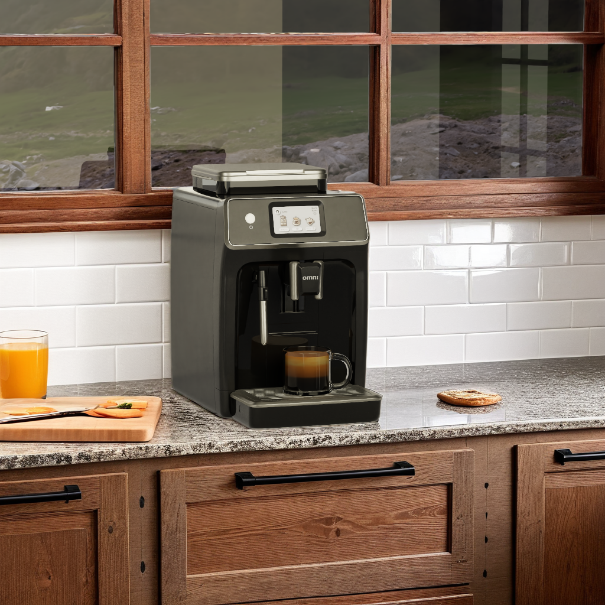

# **Adding Extensions**

*Required for creating your own application*  



*Image generated with live interactive demo.*

To replicate the functionality as experienced on [NVIDIA Omniverse Blueprints](https://build.nvidia.com/nim/agent-blueprints), you'll need to add extensions to the custom app built from kit-app-template. However, if you did not create your own application then this part is already done for you and is part of the Blueprint download.

Here's how to add the necessary extensions to your custom application: </br>
   > :exclamation: Please read this section carefully.


1. Open the file location where you saved/cloned this repository and navigate to the applications folder, e.g: `{full-path-kit-app-template}\source\apps` </br>
   
2. Copy all 3 of the blueprint's apps that exist in the apps folder of the Blueprint Repository to the applications folder of YOUR custom kit-app-template.
      1. First copy over the following application: `omni.app.conditioning_for_precise_visual_generative_ai.kit`
      </br>
      :exclamation: Do not change this file or the name of this. 
      </br>

      2. Then copy over `omni.app.conditioning_for_precise_visual_generative_ai_desktop.kit` and rename it to your app name (e.g., `my_company.my_editor.kit`)
      </br>

      3. Do the same for the application `omni.app.conditioning_for_precise_visual_generative_ai_streaming.kit` </br>
      (e.g., `my_company.my_editor_streaming.kit`)
      </br>

   > At the end of this step you should have 3 applications in YOUR custom kit-app-template.</br>
   >1. `omni.app.conditioning_for_precise_visual_generative_ai.kit`
   >2. `my_company.my_editor.kit` 
   >3. `my_company.my_editor_streaming.kit`

   </br>
3. Locate the extensions folder of the blueprint's repository, `{blueprint-repo}\source\extensions`
   </br>
4. Copy the **blueprint's** extensions to **your kit-app-template** extensions folder (e.g. `{full-path-kit-app-template}\kit-streamer\source\extensions`)
   </br>
5. Navigate to **your app's** `premake.lua` file at `{full-path-kit-app-template}\premake.lua`
   </br>
6. Locate the `define_app` calls and add new a `define_app` as follows:
   ```
      define_app("omni.app.conditioning_for_precise_visual_generative_ai.kit")
   ```
   Save `premake.lua`
   </br>
7. Navigate to your app's `repo.toml` file at `{full-path-kit-app-template}\repo.toml`
   </br>
8. Edit the `Extensions precacher` section as follows:
   ```
      [repo_precache_exts]
      # Apps to run and precache
      apps = ["${root}/source/apps/omni.app.conditioning_for_precise_visual_generative_ai.kit", "${root}/source/apps/my_company.my_editor.kit", "${root}/source/apps/my_company.my_editor_streaming.kit"]

      registries = [
         { name = "kit/default", url = "https://ovextensionsprod.blob.core.windows.net/exts/kit/prod/106/shared" },
         { name = "kit/sdk", url = "https://ovextensionsprod.blob.core.windows.net/exts/kit/prod/sdk/${kit_version_short}/${kit_git_hash}" },
         { name = "kit/community", url = "https://dw290v42wisod.cloudfront.net/exts/kit/community" },
      ]
   ```
   </br>
9.  Locate the `pip.toml` file at `{full-path-kit-app-template}\tools\deps\pip.toml`
    </br>
10.  Copy over the content from the same file on the blueprint repo at `{full-path-blueprint-repo}\kit-streamer\deps\pip.toml`
    </br>
11.  Change the relative pathing from `..` to `../..` for each line that has a path.
    Save your changes.
12. Rebuild and Restart the application.
    </br>
        **Linux**: `./repo.sh build` | `./repo.sh launch -d` </br>
    **Windows**: `.\repo.bat build` | `.\repo.bat launch -d`

You can read any of the `*.kit` files in your apps folder to see how extensions are added (i.e. `"omni.ai.viewport.core" = {}` under *[dependencies]*).

   > **Note** \- Use this same process to add your own custom extensions as you further develop your experience.
----
| [&larr; Back to Guide](../README.md) |___________________________________________________________________________  | [Next (Configure Extensions) &rarr;](./config_ext.md) |
|-------------------------------|--|---------------------------------------------|