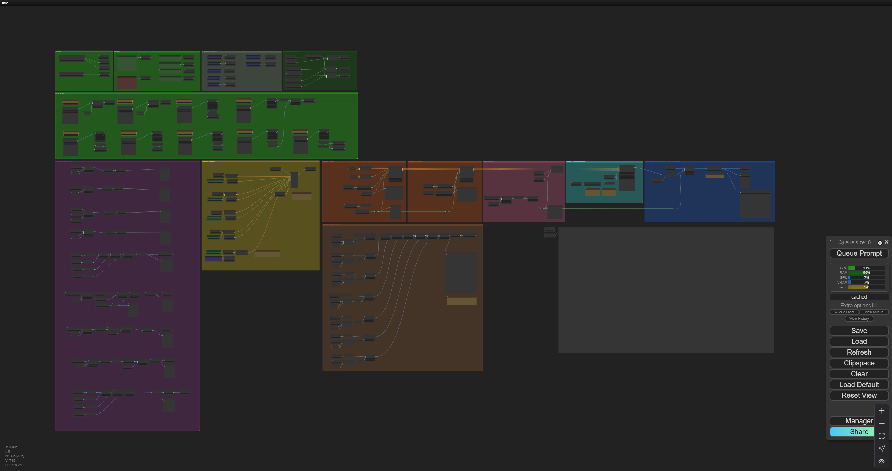
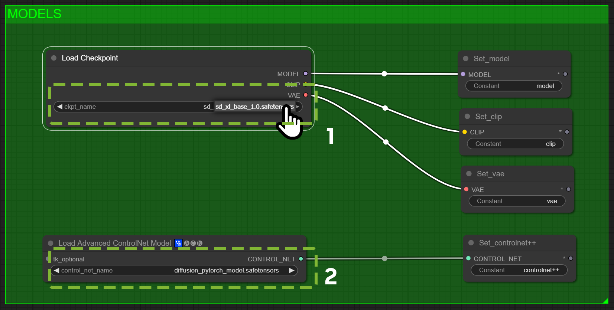
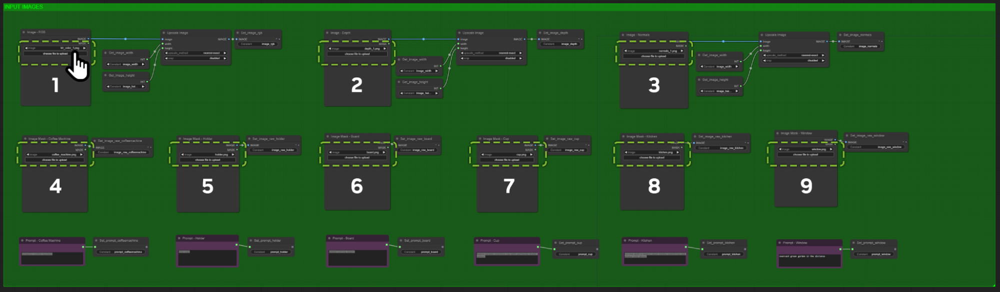
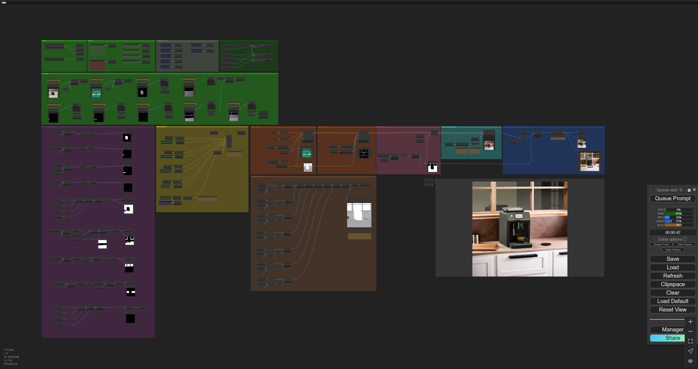

# **Assigning Models and References**

Now, your ComfyUI graph should look similar to the example shown below. Next, the models and image references in the `green` sections need to be assigned.

This section demonstrates the manual set up of comfyUI with the example graph and images. The intent is to show where comfyUI operates in the workflow, to get an understanding of what the graph does internally and to play around with prompts and parameters.

Ultimately, ComfyUI is connected to your Kit application and the output of that app is sent as masks and images to the graph.

1. In the `Models` section locate the `Load Checkpoint` node.
2. Assign `sd_xl_base_1.0.safetensors` model to the node by clicking on the highlighted section and select the mode from the popup list.
     >This must be done to refresh the assignment of the model. Even though it may show correctly, if not reassigned here, queueing a prompt later may create an error.

3. Below the "Load Checkpoint" node, locate the node `Load Advanced ControlNet Model`.
4. Assign the model `diffusion_pytorch_model.safetensors`.
   
    

   
5. Next assign the sample images to the nine `Input Images` nodes.

   

   1. Click on `upload` for each of the nodes and select the images corresponding sample image for that node. The sample images are found in the Sample Files downloaded in the [Requirements and Installation](./comfyui_install.md) section.  
      1. `Image - RGB` Node  
         `sample_files/rgb.png`  

      2. `Image - Normals` Node  
         `sample_files/normals.png`

      3. `Image Mask - Coffee Machine` Node  
         `sample_files/coffee_machine.png`  

      4. `Image Mask - Jar` Node  
         `sample_files/jar.png`  

      5. `Image Mask - Board` Node  
         `sample_files/board.png`  

      6. `Image Mask - Plate` Node  
         `sample_files/plate.png`  

      7. `Image Mask - Not Walls` Node  
         `sample_files/non_walls.png`  

      8. `Image Mask - Kitchen` Node  
         `sample_files/kitchen.png`  

6. In the ComfyUI menu, click the **Queue Prompt** button.
7. When complete, the generated image is  displayed in the 'Save Image' node at the farthest right edge of the graph.  
   1. Saved images are written by default to the ComfyUI installation `ComfyUI\output` folder.  
8. The final graph with a successfully completed prompt should look like the example shown below:  
   

If you are interested in learning more about the ComfyUI graph, go to the next section [Augmentation Graph Breakdown](./graph_breakdown.md)

Or skip to the section [Connecting the Kit App & Image Generation Service](./connect_comfyui_app.md).

----
[&larr; Back to Guide](../README.md)                     [Next (Augmentation Graph Breakdown) &rarr;](./graph_breakdown.md)