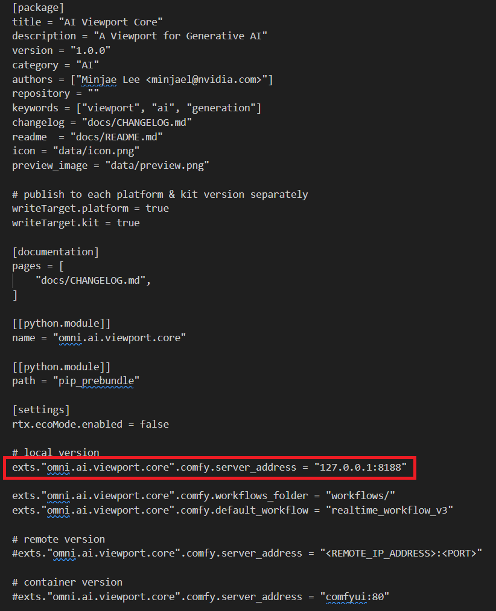

# Connecting the Kit Application and the Image Generation Service

The Kit application queries the image generation service and receives image as output. Thus, you should get the ip address and port exposed to you by your own service (i.e. ComfyUI) and plug it to the extension.toml file for `omni.ai.viewport.core`. The ip address can be local or remote.

Make sure that only one `server_address` is enabled. For instance, if you were to use the local version, double check to make sure that those under the other versions are disabled with `#`.

----
| [&larr; Back to Guide](../README.md) |___________________________________________________________________________  | [Next (Prompting Best Practices) &rarr;](./prompt_bp.md)|
|-------------------------------|--|---------------------------------------------|