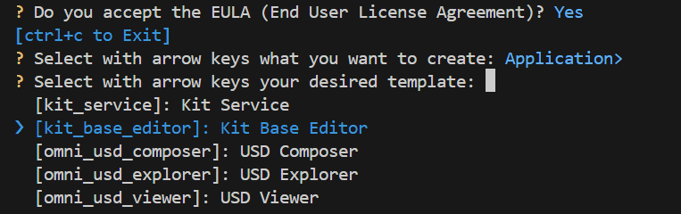

# Creating Your Own Application

If you wish to create your own Kit application, continue reading this section.

>If you do not want to create your own application, refer to the section [Run the Application](./customize_app.md).

The first step with these microservices is to set up a custom application, which you can then use to connect to the microservices and develop custom tools for building your generative AI images. Setting up your custom application is a foundational step, and the environment you build can be used with multiple use cases. 

We will be using the [Kit App Template](https://github.com/NVIDIA-Omniverse/kit-app-template/) to build our custom application. Kit-App-Template enables developers to fine-tune their custom application needs based on Kit 106.2.

Before getting started with the Kit template defined here, ensure your development environment meets the system requirements outlined in the [system requirements](../blueprint_guide/get_started.md/#system-requirements) document.

1. Clone the Kit App Template repository using the following command:  
   ```
   git clone https://github.com/NVIDIA-Omniverse/kit-app-template.git  
   ```

   >:exclamation: You will need to enable gitLFS to clone this repository. Please see the [Troubleshoting](./troubleshooting.md) section for more details.

2. Go to the kit-app-template directory by running the following command:  
   ```
   cd kit-app-template
   ```

   > **Note Windows Long Path:** When cloning the kit-app-template repository, some Windows users may experience issues if the directory is deeply nested in their file system. To avoid this issue, place the kit-app-template repository near the root of the file system to avoid long path issues.

     
3. Create a new application using the command line. For this example, we will be following [the Kit-App-Template instructions](https://github.com/NVIDIA-Omniverse/kit-app-template/tree/main/templates/apps/kit_base_editor) to set up the Kit Base Editor.  
4. Create a new application by running the following command:

    **Linux**: `./repo.sh template new` </br>
    **Windows**: `.\repo.bat template new`

5. Follow the prompt instructions.  
   * Select **Yes** to accept the EULA agreement.  
   * Select **Application** using arrow keys.  
   * Select **Kit Base Editor** using arrow keys.
     
   * Enter name of the application `.kit` file.  
     * **This should be name-spaced, lowercase, and alphanumeric**.  
   * Enter the application display name *\[set application display name\]*.  
   * Enter Version *\[Set App Version\]*.  
6. Build your application using the provided build scripts:

    **Linux**: `./repo.sh build` </br>
    **Windows**: `.\repo.bat build`

7. Launch your application in **developer** mode.  

    **Linux**: `./repo.sh launch -d` </br>
    **Windows**: `.\repo.bat launch -d`

8. Select with arrow keys which application would you like to launch. For example, `my_company.my_editor.kit`


   > **Note** Do not select `my_company.my_editor_streaming.kit`.

   The initial startup may take 5 to 8 minutes as shaders compile for the first time. After initial shader compilation, startup time is  reduced.


----
| [&larr; Back to Guide](../README.md) |___________________________________________________________________________  | [Next (Add Extensions) &rarr;](./add_ext.md)|
|-------------------------------|--|---------------------------------------------|