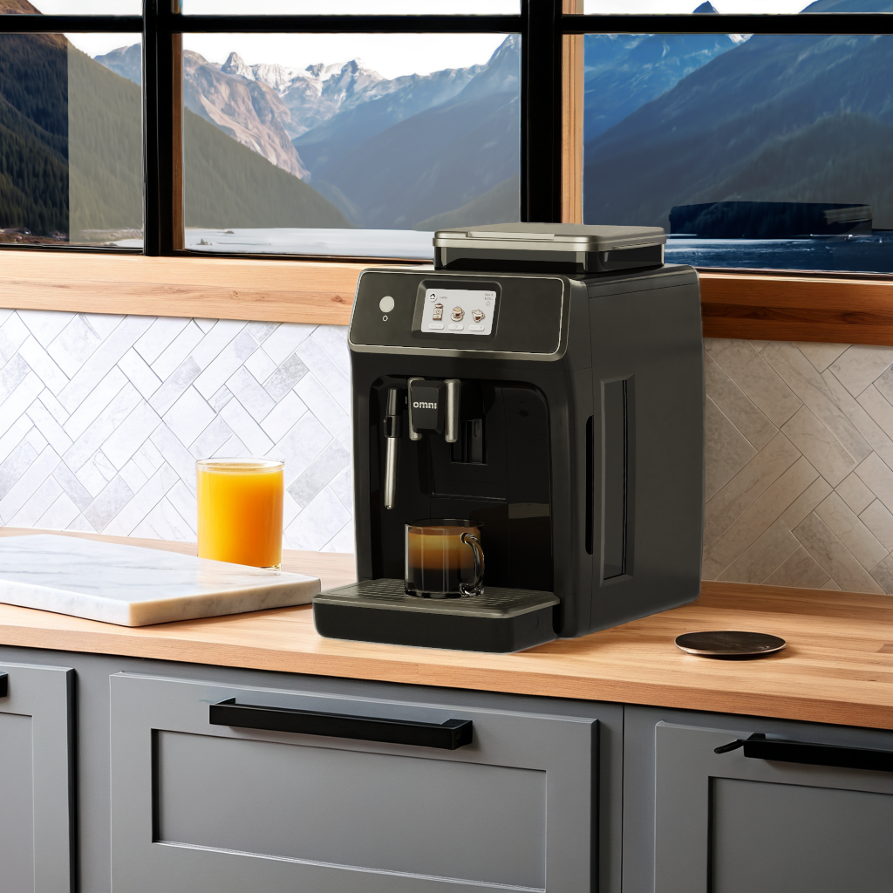

# Run the Application

*Image generated with live interactive demo.*

After you have experienced the Interactive demo from NVIDIA Blueprint website, you may want to customize the experience to your own needs. We provide two options in this blueprint, the following will run the application without any configuration. If you wish to customize your own application, skip to the next section [Create your own Application](./create_app.md).

## Running the Local Desktop Application

If you wish to simply build and try out the local desktop sample, read this section. This will run a Kit application that locally reproduces a similar experience to the Interactive demo from NVIDIA Blueprint website, EXCEPT that the image generation service is will return a static image. If you want to create your own image generation service, follow the section [configure the image generation service](./config_img_srv.md).

>If you wish to create your own Kit application, skip to the next section.

You can build the stub image generation service first by going into the directory and following these steps:

1. Build `pip install -r requirements.txt` (you should be in `imagegen_stub` directory)
2. `python imagegen_stub.py`

Then, open another terminal or CMD, then build `kit-streamer` (instruction is inside the directory, which we have copied here for convenience):

1. Please follow [this step](#connecting-the-kit-application-and-the-image-generation-service).
2. Build the Kit application:

     **Linux**: `./build.sh -r`
     **Windows**: `build.bat -r`

3. Run the Kit desktop application:

     **Linux**: `./_build/linux-x86_64/release/omni.app.conditioning_for_precise_visual_generative_ai_desktop.sh`
     **Windows**: `_build\windows-x86_64\release\omni.app.conditioning_for_precise_visual_generative_ai_desktop.bat`

When you press the run button, you are expected to see the following image as output: 
 

You can further modify the source code in their respective directories and locally test them.

For more information on how to configure the image generation service, see the section for [ComfyUI](./comfyui.md).

You can also reproduce the web version in the [Deployment subsection](./run_without_kubernetes.md).

 > **NOTE:** If the desktop application's font size is too small, adjust the setting `app.font.size = 18` in the file `omni.app.conditioning_for_precise_visual_generative_ai_desktop.kit`
----
[&larr; Back to Guide](../README.md)                     [Next (Create Your Own App) &rarr;](./create_app.md)