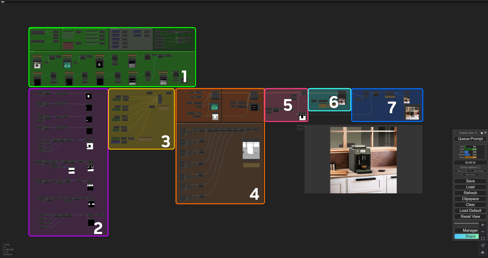
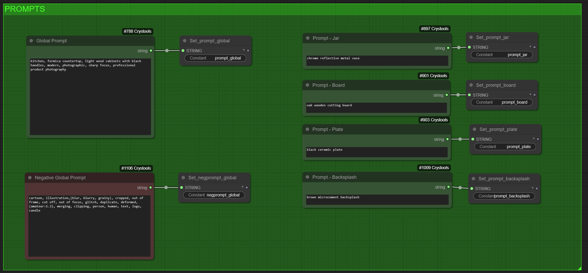
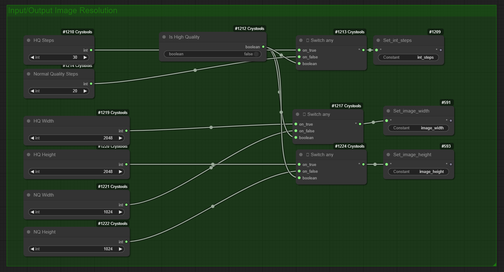
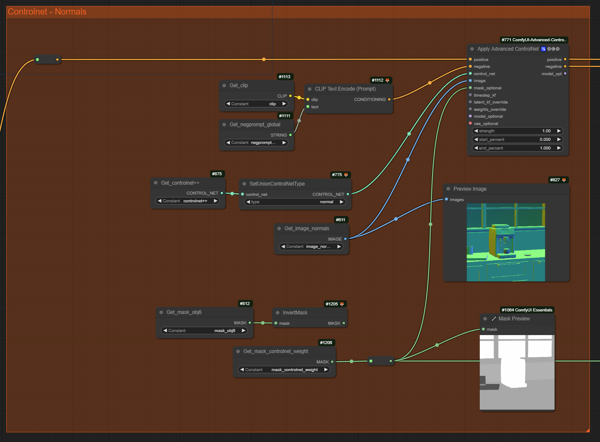
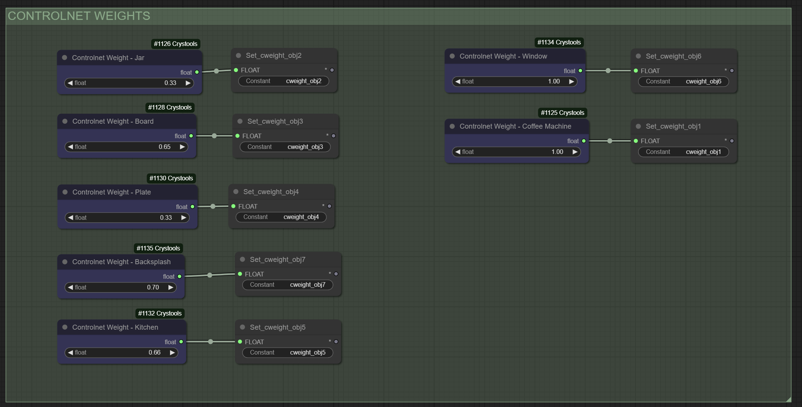
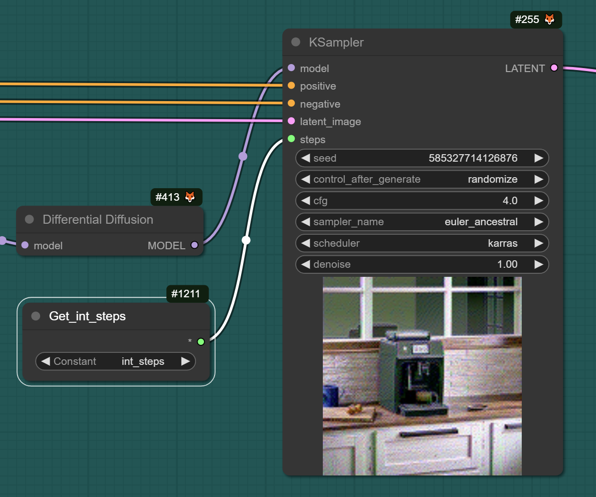

### **Augmentation Graph Breakdown**

The ComfyUI graph itself is a developer tool for building and iterating on pipelines. Another way to think about it is 'programming with models'. 

Below is an image of the example graph and the different sections and their purpose.

Overall, the graph uses 'regional prompting' with the masks. This allows us to describe the visual properties of the different parts of the image.

Let's explore the graph for a more complete understanding of how it works.

1. **Load Images and Models, Prompts and Generation Quality**  
   1. This is the section where setup was performed. Input images, model, image size, and global and regional prompts are all here.  
   2. Prompts are primarily responsible for the changes in output generations. The `Global Prompt` controls the overall influence for the scene generation. We describe features of the kitchen here, such as style and lighting, the materials of the counter top, window frames and cabinets.
  
       

   3. The Mask Prompts (to the right) control the visual aspects of each masked area. You can get specific with details of the masked objects in the scene, such as the backsplash, plate, vase and cutting board.

   4. The image resolution can be set here, along with the biggest factor in image quality; the 'steps'. Lowering steps to 10 will reduce generation time but negatively affect quality. Conversely, around 20 can give better results at the expense of time.
  
        

2. **Process Images and Masks**  
   1. The masks and images are processed into a format suitable for the regional prompting and other areas of the graph. 
   2. When connected to the Kit application, it sends ComfyUI the information it needs.  
   
3. **Regional Prompting**  
   1. The `Conditioning (SetMask)` nodes take a prompt and a mask to determine the conditioning of the different parts of the image. These nodes and prompts form the heart of the graph and are the most important piece influencing the output generations.  
   2. The prompts used in this section can be found and changed in the **Input Images** and **Global Prompts** green sections.  
   
4. **ControlNets**  
   1. The `Controlnet` models are used to constrain and inform guidance for the generation of the outputs. These are critical for the control of the structure of the outputs. Without these, the model would be free to imagine anything loosely based on the prompts, with no adherence to the exact placement of the objects in the scene.  
   2. We use 'Normals' and 'HED' (outlines) as the guides to help the model adhere to the structure of the input image.  
   3. The controlnet 'strength' values (shown in the image below) can be adjusted to relax the adherence to the normals and outlines. Lower values give the model more 'creative' freedom in what gets generated but may deviate from the shape and boundaries of the 3D scene.
      

   4. We also create a weighted mask to guide the controlnet strength per mask. For example, the backsplash could have a low weighting, giving the model more creative freedom, while keeping the vase and plate at 1.0 so they closely follow the input controlnet images. The controlnet weights are set in the green sections at the top of the graph as shown below. 
      

5. **Inpainting**  
   1. Inpainting (or outpainting) simply means generating a masked area inside or outside of an area that remains unchanged. In this case, the espresso machine is unchanged while the outer areas are generated.  
   
6. **KSampler**  
   1. This is the node that performs the work in the graph. It iteratively denoises the image over many steps until it completes.  
      

   2. When using different models, the steps, cfg, sampler\_name and schedulers should be tuned to get the best results. Details of the parameters and their functionality can be found [here](https://blenderneko.github.io/ComfyUI-docs/Core%20Nodes/Sampling/KSampler/).  

7. **VAE Decode and Composite**  
   1. This simply decodes the image from latent space, composites the masked espresso machine back in, and saves the result.

### Normal Map and Outline (HED) Controlnets

    Controlnets use images to guide the model's outputs. In the example we use normal maps, and outlines. This helps the model maintain the shapes of the geometry in the scene, and ‘understand’ edges and discontinuities and object bounds.

    Controlnets are an incredible tool for constraining models but they can come at the expense of model creativity or visual realism.

    If you want to make the ‘plate’ into a bagel, you’re asking the model to do two conflicting things, because the shape of the normals and outline controlnets is trying to adhere to a plate shape. The strength of the controlnets can be modified in the graph section “Controlnet Weights”. The resulting weight image is displayed in the controlnet section (section 4). Lowering the weight of the ‘plate’ region will free the model up to generate different objects of different shapes and sizes.

    Using Controlnets is a balance between control and creativity. Some experimentation can be needed to find the sweet spot.

This is just a basic outline of how this example of ComfyUI's graph works. The specifics can vary depending on the model, the prompts, the image, and the settings used.

----
[&larr; Back to Guide](../README.md)                     [Next (Connecting the Kit App & Image Generation Service ) &rarr;](./connect_comfyui_app.md)