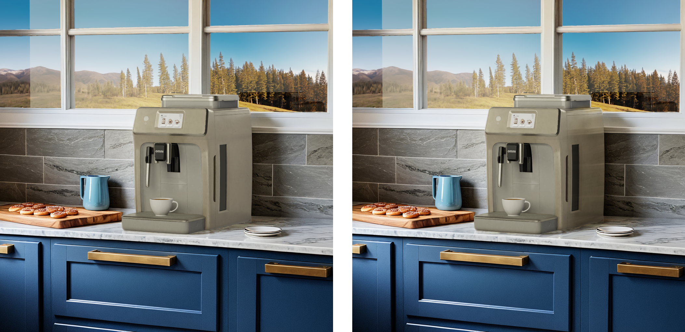

# Improved Lighting Options

You may want to alter the set up to help render the hero asset seat into the scene more naturally, depending on your existing scene and lighting.  While we didn't demonstrate this in this blueprint, it is something you can develop in addition using the basic technique mentioned here.

*Image generated with live interactive demo.*

----
[&larr; Back to Guide](../README.md)                     [Next (Render Additional Passes) &rarr;](./render_passes.md)