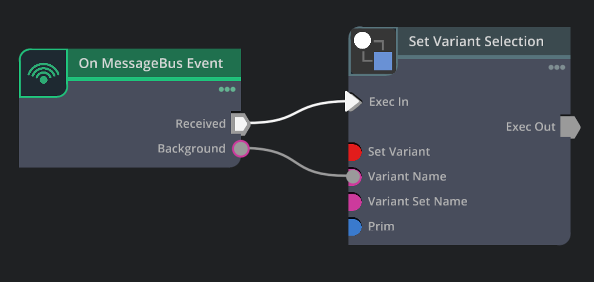

# Messaging & Configurable Assets

*Optional*

If the desire is to have a custom front end, such as a web page with an embedded viewport, then you must use some extra extensions, as well as implement some event messages both in the published content and your React web page.

1. Ensure the streaming webrtc extensions are added to your Kit application.  
2. Add Messaging and streaming extensions to your custom Kit application. See the [Embedded Web Viewer](https://docs.omniverse.nvidia.com/embedded-web-viewer/latest/index.html) example for more information.
3. Add React components to your web page and set up messaging events. Learn more about this as well as testing your web page with your custom Kit app here \-  [Embedded Web Viewer](https://docs.omniverse.nvidia.com/embedded-web-viewer/latest/index.html)  
4. [Using Event Source Nodes](https://docs.omniverse.nvidia.com/extensions/latest/ext_omnigraph/tutorials/using_event_nodes.html)  
   1. Action Graph is used to control USD Variants [Variant Nodes](https://docs.omniverse.nvidia.com/auto-config/latest/build-config-functions/variant-nodes.html#variant-nodes).   
   2. Action Graph Messaging is used to listen for messages from your front end website or application [Message Bus Event Nodes](https://docs.omniverse.nvidia.com/auto-config/latest/build-config-functions/message-bus.html#messagebus-event-nodes)  
5. Test your application

----
| [&larr; Back to Guide](../README.md) |___________________________________________________________________________  | [Next (Deployment) &rarr;](./deployment.md)|
|-------------------------------|--|---------------------------------------------|