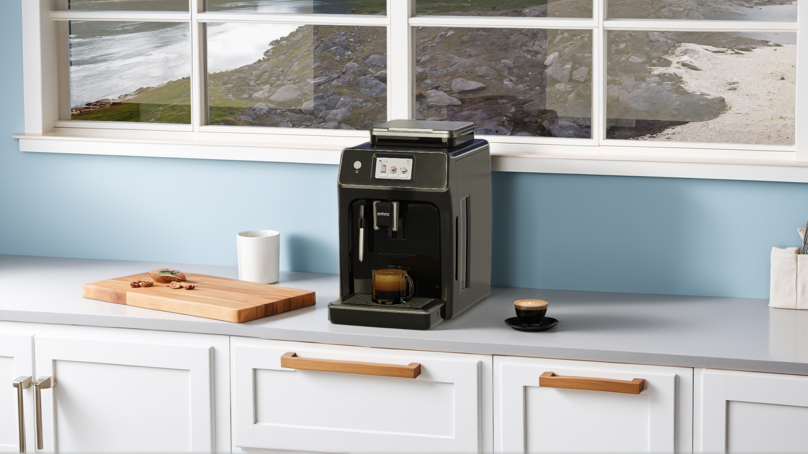

# Scene Layout with NIM

*Optional* 

In this NVIDIA Omniverse Blueprint, content creators have flexibility in their layout. While traditional methods like using a content browser to drag and drop assets or moving assets with a manipulator are still available, the layout workflow can be enhanced using two NIM microservices.  

* **USD Search**: Expedites finding assets already in your asset library.  
* **USD Code**: Helps you learn about USD, provides sample code, and allows layout modifications using natural language commands.

As a developer, you can enable this type of workflow by implementing these NIM microservices. These are initially presented as extensions that connect to an API key.

* Add these extensions to your custom Kit application following the [adding extensions](./add_ext.md) section.
* Try additional use cases outlined here to mix and match for your own workflows:  
  [Use Cases — Generative AI for Digital Twins Guide latest documentation (nvidia.com)](https://docs.omniverse.nvidia.com/guide-sdg/latest/case-studies.html#case-studies)

Here are some examples of the types of prompts that can be enabled for your users. You can learn more about how to use the following NIM microservices via the Omniverse Sample Kit Extension by following steps in the [USD Code NIM documentation](https://docs.omniverse.nvidia.com/services/latest/services/usd-code/get-started.html#usd-code-nim-in-an-omniverse-kit-based-application). For demonstration purposes, please view a demo [here](https://www.wpp.com/en/news/2024/07/wpp-to-create-generative-3d-worlds-in-collaboration-with-nvidia).

Use **USD Search** NIM to find assets in your database and add it to your stage.

* Cabinets and counter tops are the start of any kitchen; from there you can add tabletop items such as cups, plates, fruit, or any other items you may find in a Kitchen.   
* Use the NIM to locate your published hero assets. For this example, it is the espresso machine.

Ask **USD Code** NIM to place the espresso machine on top of the kitchen counter.

* For accent objects, such as a cup, you can ask USD Code NIM to create two copies of your cup**,** and place each cup on the surface of the Kitchen counter to the right of the espresso machine  
* Easily change the size of objects by asking USD Code NIM to increase or decrease the scale of one of your fruit assets by 10%.

 

*Image generated with live interactive demo.*

----
| [&larr; Back to Guide](../README.md) |___________________________________________________________________________  | [Next (Augment the Content Library with Edify) &rarr;](./content_library.md)|
|-------------------------------|--|---------------------------------------------|