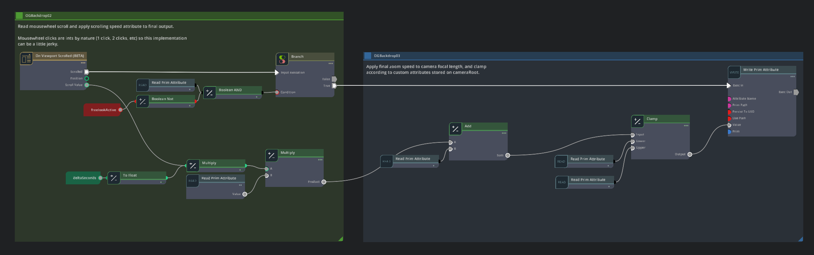

# Set Up Custom Navigation

*Required*

The default navigation of the Kit-app-template is disabled in favor of a more elegant navigation method that is catered to the end user experience, which is orbit and zoom with just the mouse. This allows for a simpler experience, allowing the end user to focus on creating beautiful images instead of learning how to navigate the stage. This type of modification is authored as part of the content scene.

Read about how to use Action Graph to implement a focused orbit and zoom navigation scheme for your content. 

* [Using the Configurator](https://docs.omniverse.nvidia.com/auto-config/latest/build-config-functions/using-the-configurator.html)   
* [Viewport Control and Input Event Nodes](https://docs.omniverse.nvidia.com/auto-config/latest/build-config-functions/viewport-control.html)

 > **Note** \- If you decide not to implement the custom navigation, then the standard mouse \+ WSAD is the default behavior for navigating the viewport.

*Also note that Action Graph is not the only means to modify navigation. Navigation can be modified through Python.*

----
| [&larr; Back to Guide](../README.md) |___________________________________________________________________________  | [Next (Messaging for Web Based Front End) &rarr;](./messaging_web.md)|
|-------------------------------|--|---------------------------------------------|