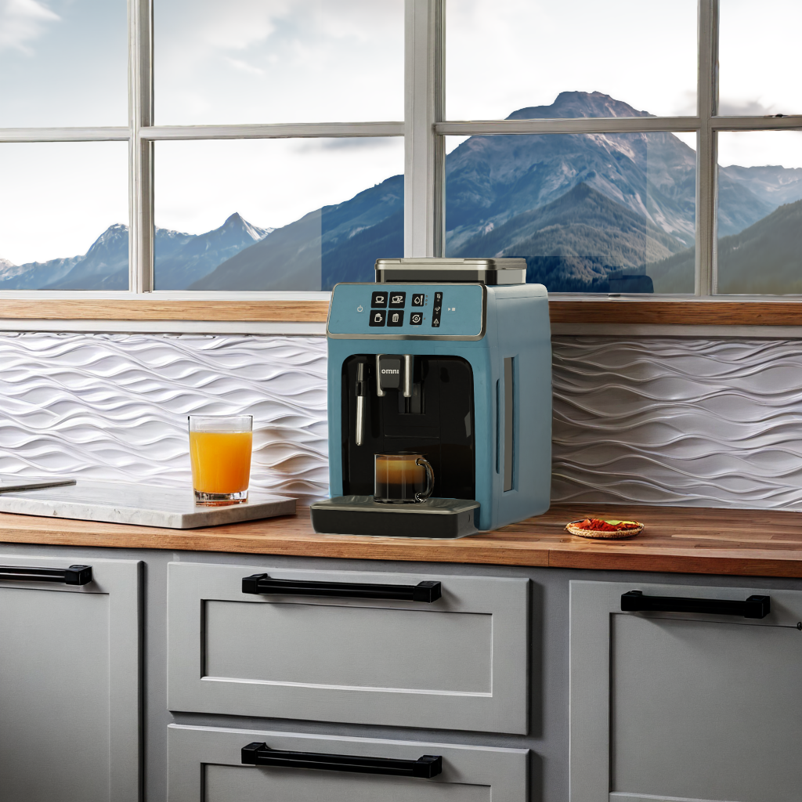
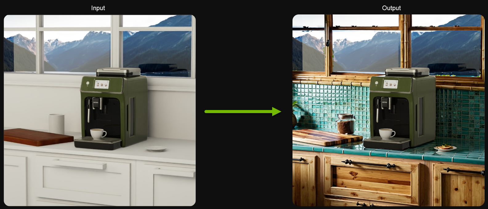
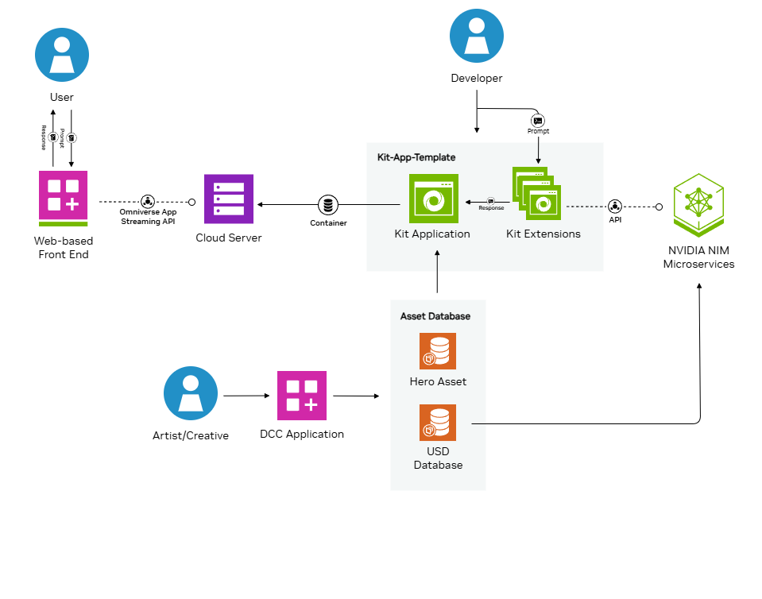

# Workflow 

*Image generated with live interactive demo.*

## **Workflow Summary**

This workflow shows how you  can augment a content pipeline with generative AI, enabling your marketing and content teams to achieve the following results.

**Standard Workflow**

*The standard workflow replicates the interactive demo on build.nvidia.com*

The standard workflow allows art directors and artists to keep the hero content rendering with high quality, ray-traced results that are consistent, while prompting generative AI for the supplementary items in the scene to try out ideas. Traditionally, this is a slow process and one that is hard to direct. This workflow shows how to direct and control specific parts of the image without impacting other parts of that same image. For example, the art director can quickly test out different counter top surfaces, while still keeping the high-quality render of their espresso machine.

The standard workflow contains four key components:

1. **On-brand hero asset:**  A finalized asset, typically approved by an art director, should be considered the hero asset. For this example, we have  provided a simple espresso machine.  
2. **Custom application:** Built with the Kit App Template based on Kit 106.2.   
3. **NIM integration:**  Microservices and Kit extensions that add generative AI functionality to your custom application.  
4. **Solution testing:** Verifies  the functionality and performance of your integrated workflow. 

*Image generated with live interactive demo.*

## **Workflow Diagram**

Follow this step-by-step guide to start your development journey with these new NVIDIA NIM microservices for generative AI development\!

To summarize the architectural workflow diagram above, we have 3 components 
* Web Front-End 
* Kit Streaming Application 
* Image Generation Service. 
  
The web front end displays the Kit streaming application hosted on a cloud server to the User through the App Streaming API and sends the text prompt created by the User. The Kit streaming application, created by a Developer, captures the viewport (RGB, Depth, Normal) and sends the merged data to the image generation service through a custom Kit extension, also created by a Developer. The image generation service processes the data (runs inference on a diffusion model and etc.) using Artist created assets, such as the Hero Asset, and generative AI to return a new 3D scene with the brand-accurate Hero Asset intact. The Kit streaming application updates with the processed scene and in return is displayed on the web front end in real time.

----
[&larr; Back to Guide](../README.md)                     [Next (Get Started) &rarr;](./get_started.md)