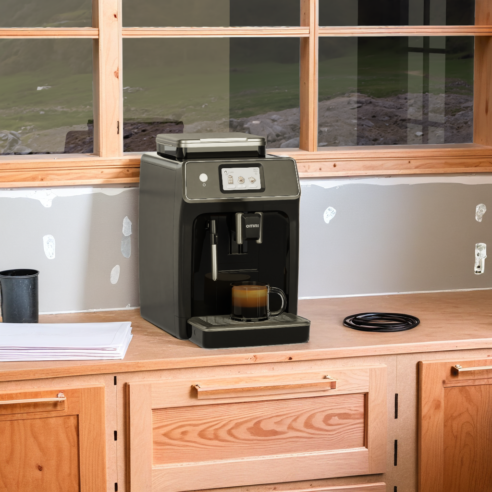

# Directable Background Generation with ComfyUI

*Required*

*Image generated with live interactive demo.*

### **Overview**

ComfyUI as used in the context of this NVIDIA Omniverse Blueprint helps teams articulate specific objects, and areas of a composition to target for prompts. ComfyUI is also used to ensure that hero assets used are not affected by any generative AI in the final image. By doing this, creators can  more accurately utilize generative AI.

For the use of this generative AI image model, a Kit extension is created to present the user with some basic controls. This Kit extension handles the processing of the viewport for the appropriate buffers and masks and sends the information to the ComfyUI graph to prompt and process. The results are then composited and displayed back to the end user as a final image.

The following integrations are used in this section:

* SDXL + ComfyUI
* Custom Kit Extensions

In the next section you will begin the process of working with ComfyUI.

----

  <table>
    <tr>
      <td align="left"><a href="./06_config_ext.md">&larr; Configure Extensions</a></td>
      <td align="center">⠀⠀⠀⠀⠀⠀⠀⠀                    ⠀⠀⠀⠀⠀⠀       </td>
      <td align="right"><a href="./08_comfyui_install.md">ComfyUI Requirements & Install &rarr;</a></td>
    </tr>
  </table>

