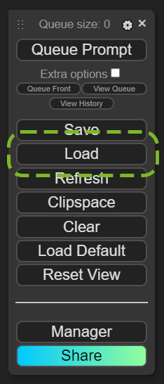
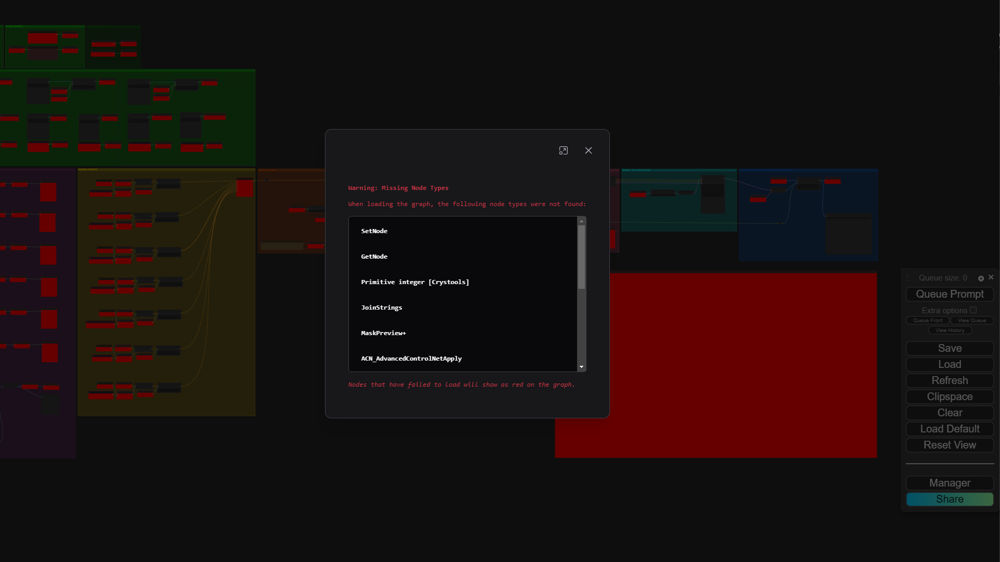
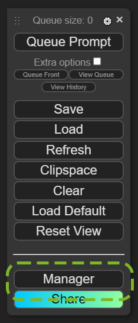
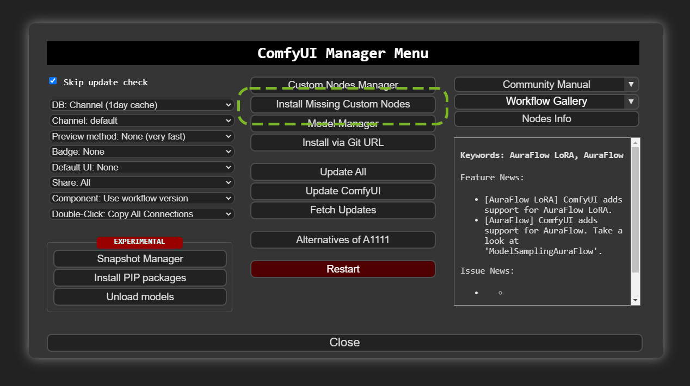
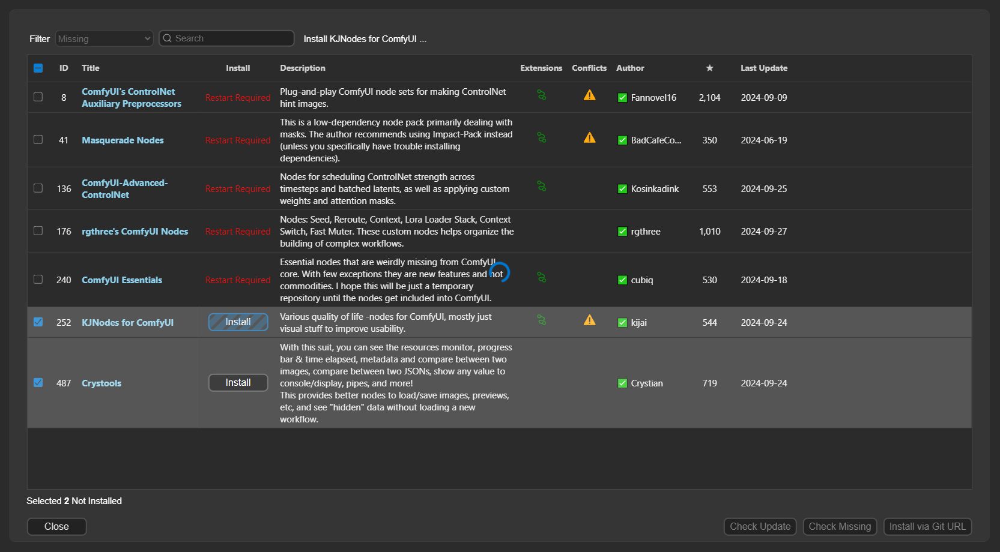

# Set Up and Open the ComfyUI Graph Example

ComfyUI is a powerful backend and GUI for building and executing pipelines using diffusion models and more.

1. Run ComfyUI.
   1. Windows Portable \- Run `ComfyUI_windows_portable\run_nvidia_gpu.bat`
   2. Windows and Linux Manual Install \- Using the command line, run `python main.py`
   3. The ComfyUI server process runs in a command line window. There, you can view what ComfyUI is doing if you need to check for errors, warnings, or to see the progress of image generations.
   4. When fully loaded ComfyUI  opens a window in your Internet browser with the local address '[http://127.0.0.1:8188/](http://127.0.0.1:8188/)'. This is connecting the visual frontend to the ComfyUI server now running in the background.
 
1. Loading the example graph.

   > [!NOTE]
   > This workflow is using ComfyUI legacy, you may see different UI than what is shown below in newer versions.

   1. Next, 'Load' the file `latest_example.json` that was downloaded earlier from the example links.
      1. Click the **Load** button on the ComfyUI menu.
      2. Navigate to the location of the downloaded `.json` graph and open it.
      
   2. You will see an error window showing missing dependencies, along with red 'missing' nodes behind it. This is expected.
      
   3. This issue can be resolved by following the steps below.
      1. Click the **Manager** button at the bottom of the ComfyUI menu.
         
      2. If you do not see a **Manager** button, see the [ComfyUI Manager](https://github.com/ltdrdata/ComfyUI-Manager) section in the 'Requirements and Installation' section of this guide.
      3. Select the **Install Missing Custom Nodes** button in the middle top section of the ComfyUI Manager Menu.
         
      4. Select **Install** for each of the listed node dependencies, or you can select the checkbox next to ID (upper left) to select them all, then select **Install**. These may take several minutes, depending on your Internet speed and hardware. You can check the progress of these downloads in ComfyUI's command line window.
         
      5. You may encounter an issue with installing the `Safety Checker` custom node. This was deprecated by the author in December 2024 and needs to be installed manually. If you do not want to use it, simply delete the `Safety Checker` node in the graph and rewire the `ImageCompositeMasked` output to `Set_FinalRGBImage`, `Send Image (WebSocket)` and `Save Image` nodes. Otherwise, installing manually can be done by cloning the [repository](https://github.com/42lux/ComfyUI-safety-checker) to the `ComfyUI\custom_nodes\` directory and restarting comfyUI. On restart the custom node will download the safety checker models, so the restart time may vary.
      6. Once you have installed all node dependencies, click on the red **Restart** button at the bottom. This restarts the ComfyUI local server to enable the newly added dependencies.

            > [!NOTE]
            > You do not need to close the browser window, but a 'Reconnecting…' dialog is  displayed until the server has been restarted.
      7. This first restart may take several minutes, downloading more dependencies as needed. You can always view the progress in the command line window.
      8. After installing the dependencies, your graph will no longer display any bright red missing nodes and you can move to the next section.

----

  <table>
    <tr>
      <td align="left"><a href="./08_comfyui_install.md">&larr; ComfyUI Requirements & Install</a></td>
      <td align="center">⠀⠀⠀⠀⠀⠀⠀⠀                    ⠀⠀⠀⠀⠀⠀       </td>
      <td align="right"><a href="./10_config_img_srv.md">ComfyUI Configure Image Gen Service &rarr;</a></td>
    </tr>
  </table>

