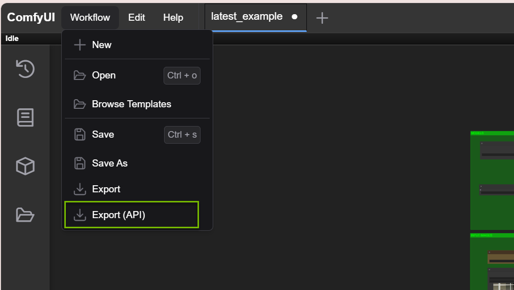
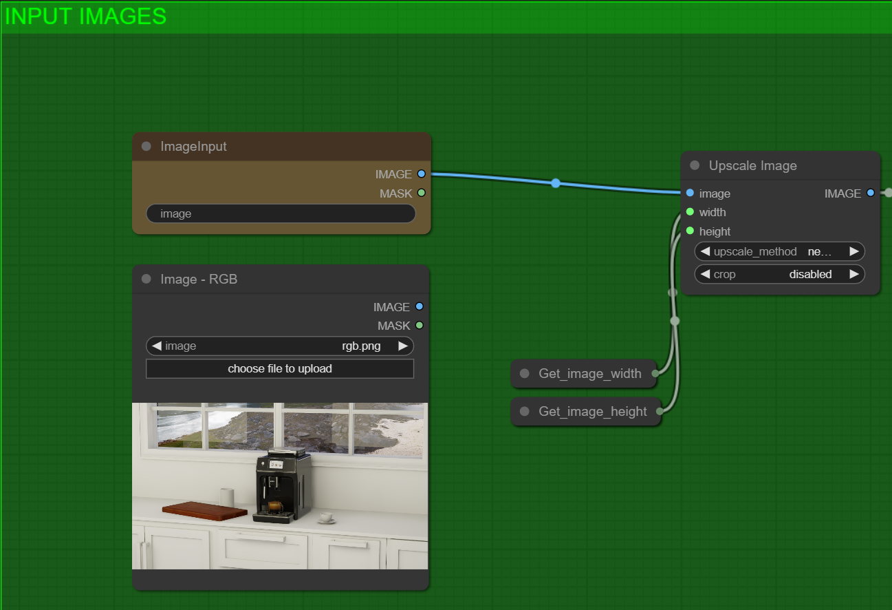

# Configure the Image Generation Service

This step covers how to configure the image generation service with the ComfyUI Graph generated from the [previous](./09_comfyui_graph_setup.md) section.

## **Running ComfyUI Locally as an Example Service**

To quickly reproduce the demo functionalities, we have provided you with an example ComfyUI graph,`latest_example.json`, which you downloaded in the section [ComfyUI Requirements & Installation](./08_comfyui_install.md).

1. Import the `json` file into your ComfyUI.
2. Click on `Save (API Format)` or in newer versions it may view as `EXPORT (API)` option in the Workflow Tab.
    
    
   > [!NOTE]
   > You may need to enable 'Dev mode Options' in the Settings in the bottom left corner of the screen.

3. Export to **overwrite** the file located in your app at `{kit-app-template/kit-streamer/source/extensions/omni.ai.viewport.core/workflows/realtime_workflow_v3.json}`.
 
 
>

>In the image above, we are referring to `latest_workflow.json` instead of `latest_example.json` graph. It is important to note the difference in how the image input is set up in these graphs. In the image above, the image inputs are hooked up to the nodes on right that receive image data from the `Kit` application.  
>**Please do not edit this file, it is only included in the blueprint as a workflow example.**

  > [!WARNING]
  > If you have added/modified/removed input text nodes or image loaders, you should make corresponding changes manually to the `.spec` file located in your app at 
  > `{kit-app-template/kit-streamer/source/extensions/omni.ai.viewport.core/workflows/realtime_workflow_v3.spec}` to hook up the Kit application and the image generation service.

* The graph should be automatically connected to the models and references but should you experience problems with running the queue or not sure how to run the queue, see the next section, [Assigning Models and References](./11_assign_models_refs.md)

* If you can run the queue without issues, feel free to skip to the section, [Connecting the Kit Application and the Image Generation Service](./13_connect_comfyui_app.md)

Before proceeding, ensure you have completed the [ComfyUI Requirements & Installation](./08_comfyui_install.md).

----

  <table>
    <tr>
      <td align="left"><a href="./09_comfyui_graph_setup.md">&larr; ComfyUI Graph Setup</a></td>
      <td align="center">⠀⠀⠀⠀⠀⠀⠀⠀                    ⠀⠀⠀⠀⠀⠀       </td>
      <td align="right"><a href="./11_assign_models_refs.md">Assigning Models and References &rarr;</a></td>
    </tr>
  </table>

