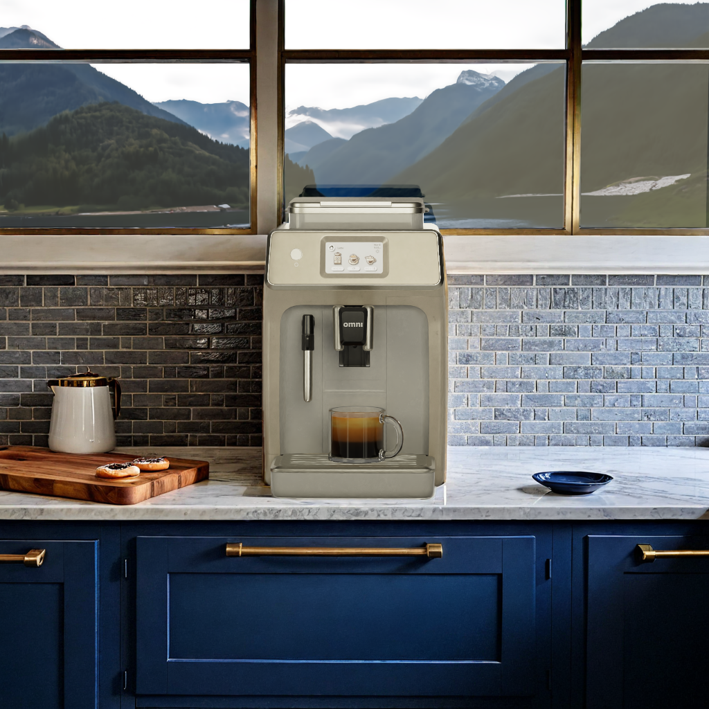
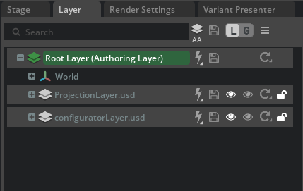
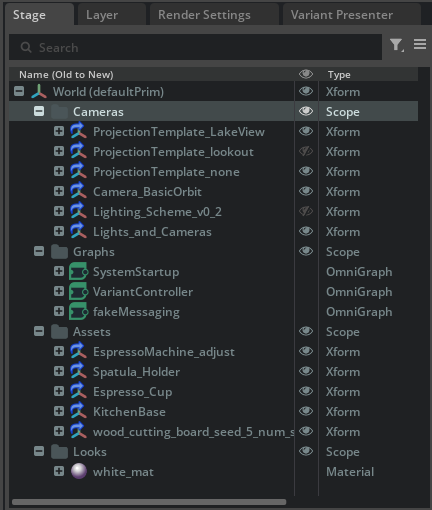
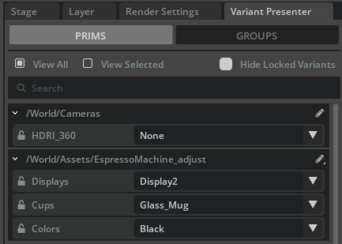

# Scene Structure and Assets

### **Espresso Machine** | Hero Asset

*Image generated with live interactive demo.*

The scene we start with intentionally only has the espresso machine fully set up with materials and lighting. The set dressing is a flat white material, it is also possible to have these objects textured if that is available. For the purposes here, having the background object just laid out in a flat white material demonstrates that an environment only needs to have basic objects blocked in order to seed the generative AI models.

The hero asset represents a final, digital version of a product. This could be anything from an espresso machine to a car. The hero asset is intended to be locked away from any generative AI so that it maintains the final signed off quality of the art and design teams, allowing it to be consistent and unchanged from its original intent.

For this demonstration, the hero asset is configurable, meaning there are several variants built into the asset. It is not required to use a configurable asset; however, it is a common use case with several advantages. Having the hero asset as a configurable asset allows your end user to rapidly switch between different components, colors, and setups with just a push of a button. Leveraging OpenUSD, these configurable assets are easy to author and make it simple to build interactive applications.

___

This rest of the scene is constructed with the following layer composition structure:

* **EspressoMachine\_Main.usd** \- this file contains references to the sublayers and has any top level edits made to the scene.
  * USD variants for the espresso machine are authored on this layer
   * Payloads and prims for the layout of the scene are added here.
* **ProjectionLayer.usd** \- This layer contains a set that we typically use for projecting HDR images to a 360 background.
   *  The USD variants for the HDR are authored on this layer
* **ConfiguratorLayer.usd** \- This file sets up some scopes to house some of the action graph functionality such as Camera Orbit, Messaging, and setting USD variants.

### **USD Variants**

The espresso machine scene is set up with the following USD variant sets:

* **HDRI 360** \- Changes the background outside the window.

    **Options**: Defaults to a non-option and has a few HDR images as options.

* **Displays** \- Changes the controls on the espresso machine.
        **Options**: Buttons or Touch Screen.
* **Cups** \- Changes the type of cup that is on the espresso machine.
        **Options**: Glass, Coffee, or Espresso.
* **Colors** \- Changes the color of the Espresso machine.

  **Options**: Black, Blue, Olive, Cream.

> [!NOTE]
> Specifically, pay close attention to USD composition structure. [Strength ordering](https://openusd.org/release/glossary.html#livrps-strength-ordering) and LIVRPS define how layers, variants, references, and payloads interact with one another. This is key to having solid USD content.

To learn more about how to assemble a configurable hero asset, see the authoring section of the [End to End Configurator Guide](https://docs.omniverse.nvidia.com/auto-config/latest/asset-authoring.html).

Best Practices for authoring variants can be found [here](https://docs.omniverse.nvidia.com/auto-config/latest/asset-authoring/new-variant-sets.html#).

----

  <table>
    <tr>
      <td align="left"><a href="./17_content_library.md">&larr; Augment the Content Library</a></td>
      <td align="center">⠀⠀⠀⠀⠀⠀⠀⠀                    ⠀⠀⠀⠀⠀⠀       </td>
      <td align="right"><a href="./19_scene_nav.md">Scene Navigation with ActionGraph &rarr;</a></td>
    </tr>
  </table>

